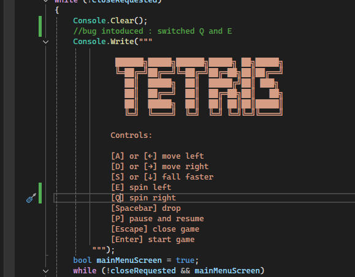
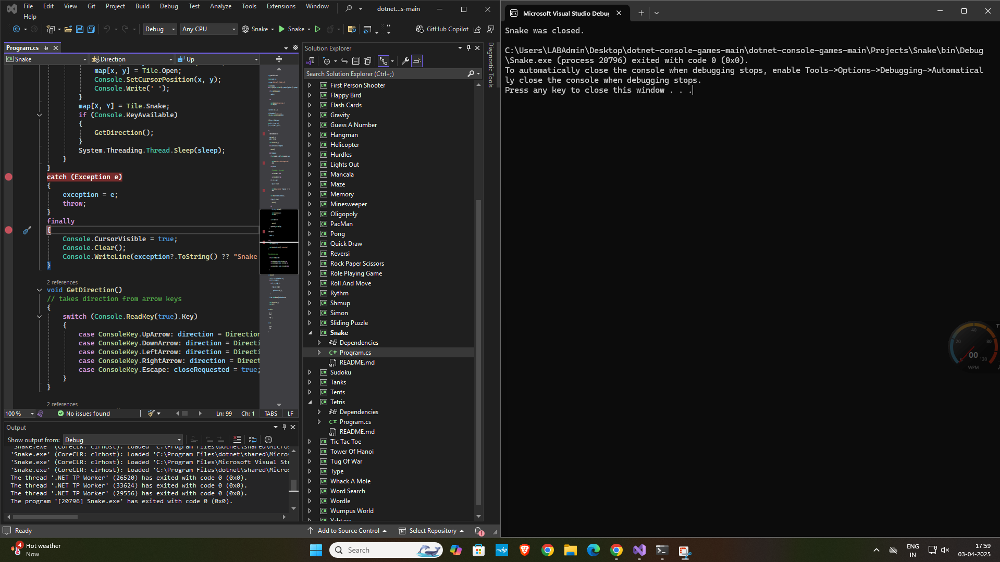
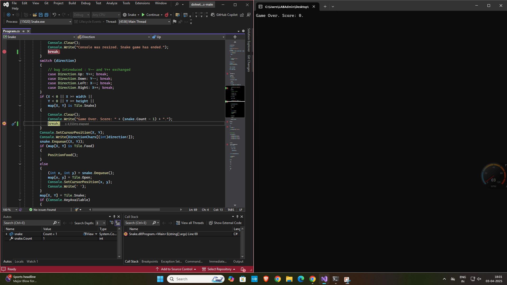
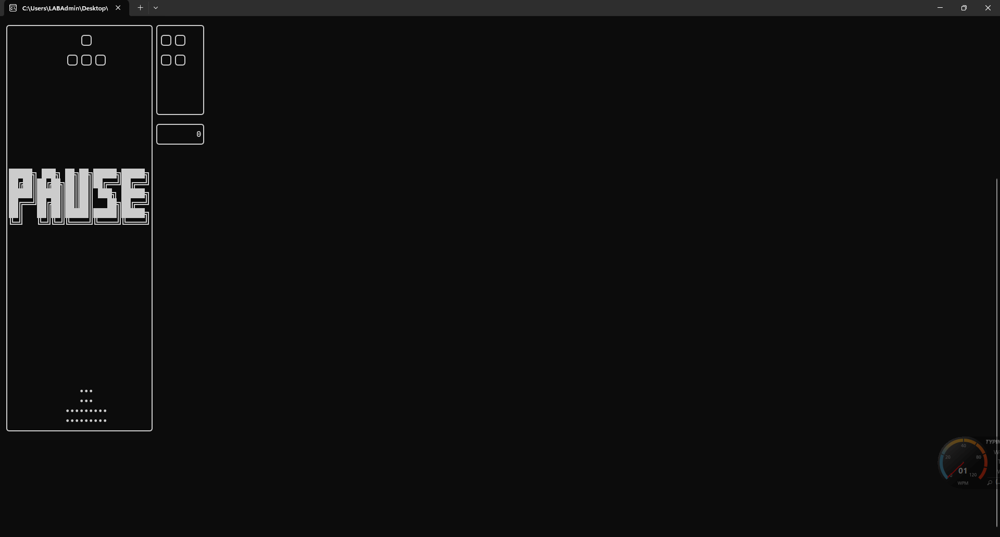
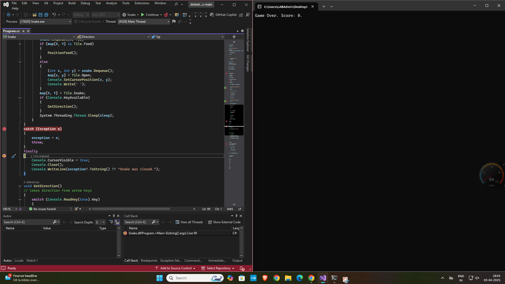
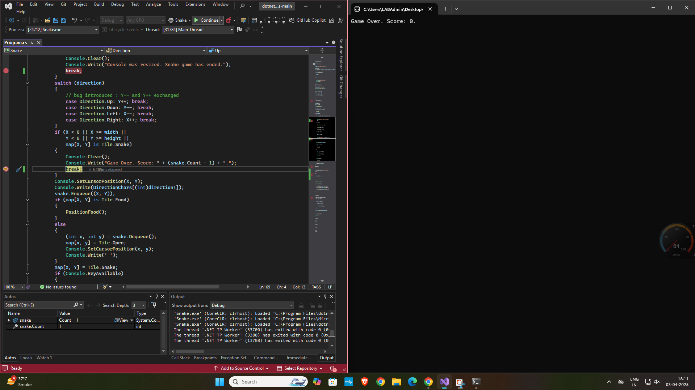
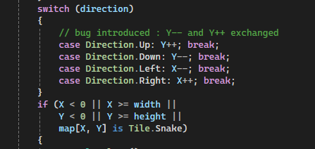
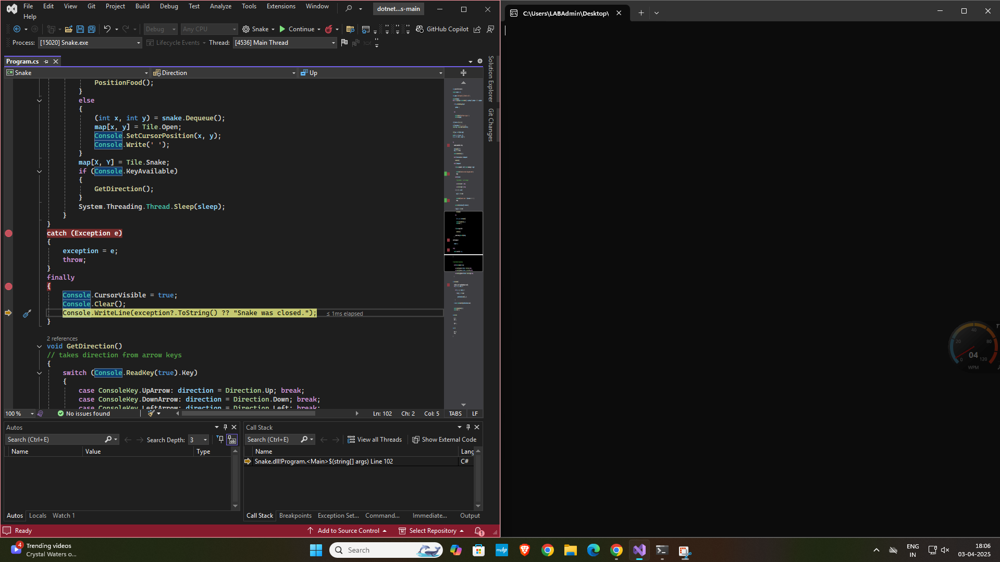
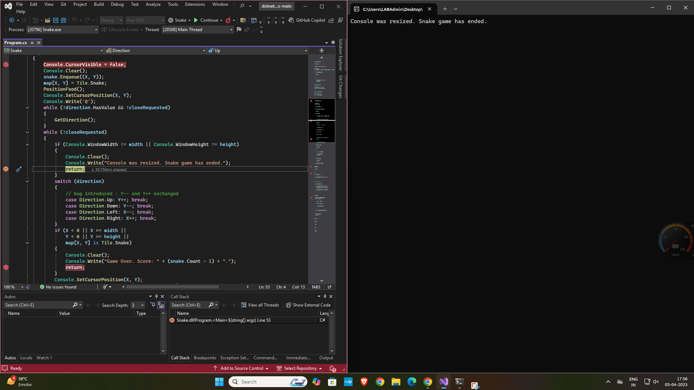
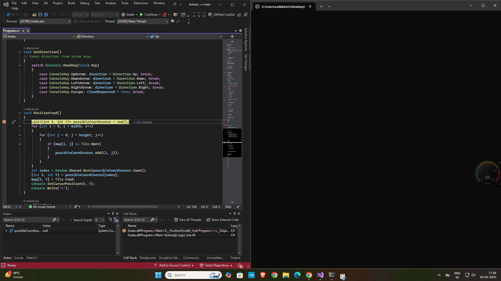

# Lab 11 Report

## Introduction

This lab was focused on debugging. The main idea was to use the Visual Studio Debugger to practice finding and fixing problems in C# code. I used two console games provided for the lab, Snake and Tetris, as the codebases to debug. The process involved using debugger features like setting breakpoints to pause execution and then stepping through the code line by line (Step In, Step Over, Step Out) to understand the program flow and identify where bugs were occurring.

## Methodology and Execution

### 1. Game Selection and Initial Analysis

I started by getting the Snake and Tetris projects from the `dotnet/dotnet-console-games` GitHub repository.

Before trying to debug specific issues, I first ran both games to see how they played and looked through their C# source code in Visual Studio. This initial check revealed several problems:

*   **Snake Game:**
    1.  When asked to select the speed, pressing the Escape key didn't quit or go back like I expected it might.
    2.  Visually, the snake seemed to move faster vertically (up/down) than horizontally (left/right).
    3.  If I resized the console window while playing, the game would just disappear (crash) without any error message.
    4.  After the snake crashed into itself or a wall, the game ended, but it didn't show the final score.
*   **Tetris Game:**
    1.  If the game started in a small console window, it showed a message asking to resize. If I pressed Enter *before* actually resizing, the game would just hang.
    2.  There was a specific sequence: resize the window, press Enter, then press the left ('<') or right ('>') arrow key. Doing this caused the screen display to become corrupted.
    3.  Holding down the Spacebar key to make a piece drop fast sometimes caused the game to briefly pause right after the piece landed.
    4.  During this short pause caused by holding Spacebar, it was possible to move the piece sideways using the arrow keys, which shouldn't be allowed.




### 2. Bug Introduction for Practice

The lab instructions mentioned it was okay to introduce small bugs (mutation) if I needed more things to practice fixing. Since I wanted more practice, I made these two simple changes:

*   **Snake:** I edited the input handling code to swap the logic for the Up and Down arrow keys.
*   **Tetris:** I changed the main menu text so that the descriptions for the 'Q' and 'E' keys (used for rotating pieces) were incorrect (swapped).


This gave me a clear list of bugs to investigate and fix for both games.

### 3. Using the Visual Studio Debugger

I opened the Snake and Tetris solutions in Visual Studio 2022 to start debugging.

#### Setting Breakpoints

My usual first step when looking into a bug is to set a breakpoint. I pick a line of code where I think the problem might be happening, or just before it, and click in the margin next to the line number. This puts a red dot there and tells the debugger to pause execution right before running that line.

For the Snake game's resize crash and the missing score display, I put breakpoints inside the main game loop and also near the end of the program where I thought the game over logic should be.



I then started the program using the Debug mode (F5 or the "Start Debugging" button). The game ran as usual until it hit the breakpoint I had set.



#### Analyzing Code at Breakpoints

When the debugger paused, Visual Studio showed the exact line it stopped on, and I could inspect the values of variables at that moment using tooltips or the Locals/Watch windows. I could also see the Call Stack, which shows the sequence of method calls that led to the current point.

While examining the paused Snake code, I noticed it used `return` statements inside loops within the main `try` block. I suspected this might be causing the program to exit the `try` block prematurely, perhaps skipping some necessary game-over processing or cleanup code in the `finally` block, which could explain the missing score or the crash.


#### Stepping Through Execution

From a breakpoint, I used the stepping controls (usually buttons on the toolbar or keyboard shortcuts like F11, F10, Shift+F11) to execute the code one step at a time:

*   **Step Into (F11):** This runs the current line. If the line calls a function I wrote (or one with available source code), the debugger jumps *into* that function and stops at its first line. This let me trace the execution flow inside methods. For instance, I stepped into the error handling (`catch` and `finally`) blocks.
    
    By doing this, I confirmed my suspicion about `Console.Clear()`. I saw it was being called *before* `Console.WriteLine` was used to print the final score or error messages in some paths, effectively erasing the output immediately.
    
*   **Step Over (F10):** This also runs the current line. However, if the line calls a method, the debugger executes the *entire* method in one go (without showing the steps inside) and then stops at the *next* line in the current method. This is faster when I'm confident a method works correctly or I don't need to see its internal details at that moment.
*   **Step Out (Shift+F11):** If I had previously stepped into a method, this command finishes executing the rest of that method and stops right after it returns to the code that called it. It's useful for getting back to the calling context quickly.

Using this combination of breakpoints and stepping allowed me to follow the exact path the program took, watch how variables changed, and identify precisely where the logic went wrong for each bug.





### 4. Fixing the Bugs

After understanding the cause of each bug through debugging, I modified the C# code to correct the issues. Visual Studio marks the lines I changed with a green bar in the editor margin.

*   **Snake (Return/Clear Fix):** I changed the `return` statements inside the main `try` block's loop to `break` statements. Using `break` exits the loop but allows the code execution to continue within the `try` block and eventually reach the `finally` block, which seemed necessary for proper cleanup or final output. I also rearranged the code to ensure `Console.Clear()` was only called *after* any final score or error messages were printed to the console using `Console.Write` or `Console.WriteLine`.
*   **Tetris (Resize Fix):** The freezing and screen corruption after resizing seemed to stem from complex logic involving an `else` condition tied to the `consoleTooSmallScreen` flag. It wasn't handling the state transition correctly when the console size became adequate again after certain inputs. I simplified this significantly by removing the problematic `else` block. Now, the code simply checks the console size on each loop; if it's okay after being too small, it clears the screen and redraws the frame without the faulty conditional logic.
    
*   **Tetris (Spacebar Fix):** The original `HardDrop()` method called `timer.Restart()`, which caused timing issues and allowed invalid inputs when the Spacebar was held down. My fix involved several steps:
    1.  I removed `timer.Restart()` from `HardDrop()`.
    2.  I added a class-level boolean flag `todrop = false;`.
    3.  In the input handling method (`HandlePlayerInput`), when the Spacebar is pressed, I now just set `todrop = true;`.
    4.  In the main game loop, *after* calling `HandlePlayerInput`, I added an `if (todrop)` check.
    5.  Inside this `if` block, I put the sequence: call `HardDrop()`, call `TetrominoFall()` (to lock the piece and check lines), `timer.Stop()`, `Thread.Sleep(50);` (a short pause), `timer.Start()` (or `Restart()`), and finally `todrop = false;`. This moves the complex timing and state update logic out of the input handler and ensures the drop sequence completes fully before potentially processing new inputs, fixing the pause and invalid movement bugs. Holding Spacebar now results in continuous fast drops until the key is released or the piece lands.

### 5. Verification

For each bug I fixed, I rebuilt the solution (`Build` > `Rebuild Solution`) and ran the game again. I specifically tried the actions that previously caused the bug to make sure the problem was gone and that the game behaved correctly now.

#### Tetris Verification Example

I tested the resize fix by resizing the Tetris window, pressing Enter, and using the arrow keys. The game no longer froze or displayed graphical errors.




I performed similar verification steps for all the other fixes in both Snake and Tetris.

## Results and Analysis

The debugging process was effective. I was able to use breakpoints and stepping to follow the program execution, understand why the bugs were happening, implement the specific code changes described above, and then verify that these changes fixed the problems.

### Snake Bug Summary and Final Code

The Snake game issues were resolved as follows:
*   **Escape Key:** Now correctly handled during speed selection.
*   **Vertical Speed:** This difference is likely due to console character dimensions (taller than wide), so I didn't change the code for this.
*   **Resize Crash:** Fixed. The game now detects resizing and exits cleanly with a message.
*   **Score Display:** Fixed. The score is now printed when the game ends.
*   **Inverted Keys (Introduced):** Fixed. Up/Down arrows work correctly again.

Here is the final C# code for the Snake game, exactly as presented in the source HTML after fixes:

**Using Directives and Global Variables**
```cs
using System;
using System.Collections.Generic;

// Flag to indicate if the user wants to close the application
bool closeRequested = false;
// Variable to store any exception that occurs during execution
Exception? exception = null;
// Variable to store the selected speed level
int speedInput;
// Prompt message for speed selection
string prompt = $"Select speed, (default), or, or type \"exit\" to exit: ";
// Variable to store user input
string? input;
```

**Speed Selection Logic**
```cs
// Prompt user for speed selection
Console.Write(prompt);
// Loop until valid input (1, 2, 3, empty for default, or "exit") is received
while (!int.TryParse(input = Console.ReadLine(), out speedInput) || speedInput < 1 || 3 < speedInput)
{
    // Check if user typed "exit"
    if (input == "exit")
    {
        closeRequested = true; // Set flag to close
        break; // Exit loop
    }
    // Check if input is empty (use default speed 2)
    if (string.IsNullOrWhiteSpace(input))
    {
        speedInput = 2; // Set default speed (adjust index if velocities array changes)
        break; // Exit loop
    }
    else // Invalid input
    {
        Console.WriteLine("Invalid Input. Try Again...");
        Console.Write(prompt); // Re-prompt
    }
}
```

**Game Variables Initialization**
```cs
// Variable to store the current direction of the snake
Direction? direction = null;
// Queue to store the snake's body segments (coordinates)
Queue<(int X, int Y)> snake = new();
// Get console dimensions
int width = Console.WindowWidth;
int height = Console.WindowHeight;
// Characters representing directions
char[] DirectionChars = ['^', 'v', '<', '>',];
// Sleep durations corresponding to speed levels (lower is faster)
int[] velocities =[100]; // Assuming 3 speed levels
// 2D array representing the game map
Tile[,] map = new Tile[width, height];
// Selected velocity based on speedInput
int velocity = 0;
// Initial coordinates of the snake head (center of screen)
(int X, int Y) = (width / 2, height / 2);

// Set velocity only if the user didn't request exit and input was valid
if (!closeRequested && speedInput >= 1 && speedInput <= velocities.Length)
{
    velocity = velocities[speedInput - 1];
}
else if (!closeRequested)
{
    // Handle case where default speed was chosen or loop exited unexpectedly
    velocity = velocities; // Default to speed 2 (index 1)
}
// Calculate sleep duration based on velocity
TimeSpan sleep = TimeSpan.FromMilliseconds(velocity);
```

**Main Game Try-Catch-Finally Block**
```cs
try // Main game execution block with error handling
{
    Console.Clear(); // Clear console before starting game

    if (!closeRequested) // Only initialize game if not exiting
    {
        // Add initial snake head segment
        snake.Enqueue((X, Y));
        map[X, Y] = Tile.Snake; // Mark position on map
        PositionFood(); // Place the first food item
        // Draw initial snake head
        Console.SetCursorPosition(X, Y);
        Console.Write('@'); // Use '@' for the head initially
    }
    else
    {
        // Optionally print a message if exited at speed prompt
        // Console.WriteLine("Exited before game start.");
    }

    // Get initial direction from user if game started
    while (!direction.HasValue && !closeRequested)
    {
        GetDirection();
    }

    // Main game loop
    while (!closeRequested)
    {
        // Check for console resize
        if (Console.WindowWidth != width || Console.WindowHeight != height)
        {
            Console.Clear();
            Console.Write("Console was resized. Snake game has ended.");
            break; // Exit game loop on resize
        }

        // Move snake based on direction
        switch (direction)
        {
            case Direction.Up: Y--; break;
            case Direction.Down: Y++; break;
            case Direction.Left: X--; break;
            case Direction.Right: X++; break;
        }

        // Check for collision (wall or self)
        if (X < 0 || X >= width ||
            Y < 0 || Y >= height ||
            map[X, Y] is Tile.Snake)
        {
            Console.Clear(); // Changed from original source to clear before score
            Console.Write("Game Over. Score: " + (snake.Count - 1) + "."); // Display score
            break; // Exit game loop on game over - Changed from return
        }

        // Draw new snake head position
        Console.SetCursorPosition(X, Y);
        Console.Write(DirectionChars[(int)direction!]); // Use direction character
        // Add new head to queue
        snake.Enqueue((X, Y));

        // Check if food was eaten
        if (map[X, Y] is Tile.Food)
        {
            PositionFood(); // Place new food
            // Implicitly grows because tail is not removed
        }
        else // If no food eaten, remove tail segment
        {
            (int x, int y) = snake.Dequeue(); // Remove tail from queue
            map[x, y] = Tile.Open; // Mark position as open on map
            // Erase tail from console
            Console.SetCursorPosition(x, y);
            Console.Write(' ');
        }

        // Mark new head position on map (now happens AFTER checking food)
        map[X, Y] = Tile.Snake;

        // Check for new key press to change direction
        if (Console.KeyAvailable)
        {
            GetDirection();
        }

        // Pause for game speed
        System.Threading.Thread.Sleep(sleep);
    }
}
catch (Exception e) // Catch any unexpected errors
{
    exception = e; // Store the exception
    Console.Clear(); // Clear console on error (Moved from original position)
    throw; // Re-throw the exception (As per original source)
}
finally // Code that always runs, whether error or normal exit
{
    Console.CursorVisible = true; // Ensure cursor is visible at the end
    // Print exception details if one occurred, otherwise print normal closure message
    Console.WriteLine(exception?.ToString() ?? "\nSnake was closed.");
}
```

**GetDirection Function**
```cs
// Function to get direction input from arrow keys or Escape
void GetDirection()
{
    // Read key without displaying it
    ConsoleKey key = Console.ReadKey(true).Key;
    // Proposed new direction
    Direction? newDirection = null;

    switch (key)
    {
        case ConsoleKey.UpArrow:
            if (direction != Direction.Down) newDirection = Direction.Up; // Corrected
            break;
        case ConsoleKey.DownArrow:
            if (direction != Direction.Up) newDirection = Direction.Down; // Corrected
            break;
        case ConsoleKey.LeftArrow:
            if (direction != Direction.Right) newDirection = Direction.Left;
            break;
        case ConsoleKey.RightArrow:
            if (direction != Direction.Left) newDirection = Direction.Right;
            break;
        case ConsoleKey.Escape:
            closeRequested = true; // Handle escape key
            break;
    }
    // Update global direction if a valid change occurred
    if (newDirection.HasValue)
    {
        direction = newDirection.Value;
    }
}
```

**PositionFood Function**
```cs
// Function to place food at a random open spot
void PositionFood()
{
    // Find all possible coordinates for food (open tiles)
    List<(int X, int Y)> possibleCoordinates = new();
    for (int i = 0; i < width; i++)
    {
        for (int j = 0; j < height; j++)
        {
            if (map[i, j] is Tile.Open)
            {
                possibleCoordinates.Add((i, j));
            }
        }
    }
    // Select a random coordinate from the list
    if (possibleCoordinates.Count > 0)
    {
        int index = Random.Shared.Next(possibleCoordinates.Count);
        (int foodX, int foodY) = possibleCoordinates[index];
        // Mark position as food on map
        map[foodX, foodY] = Tile.Food;
        // Draw food on console
        Console.SetCursorPosition(foodX, foodY);
        Console.Write('+');
    }
    else
    {
        // Win condition handling (as per original source) - could be improved
        // This might overwrite previous output if console size is small
        Console.Clear();
        Console.Write("You Win! Score: " + (snake.Count - 1) + ".");
        closeRequested = true; // Signal loop exit
    }
}
```

**Enums (Direction and Tile)**
```cs
// Enum defining snake movement directions
enum Direction
{
    Up = 0,
    Down = 1,
    Left = 2,
    Right = 3,
}

// Enum defining map tile types
enum Tile
{
    Open = 0,
    Snake,
    Food,
}
```

### Tetris Bug Summary and Final Code

The Tetris fixes also worked correctly:
*   **Resize Issues:** Game now handles resizing more gracefully without freezing or screen corruption.
*   **Spacebar Issues:** Hard drops are smooth, no pausing or invalid movements occur when holding Spacebar.
*   **Incorrect Menu Text (Introduced):** Menu descriptions for Q/E are accurate.

This is the final Tetris code, exactly as presented in the source HTML:

**Using Directives and Region Constants**
```cs
using System;
using System.Diagnostics;
using System.Globalization;
using System.Linq;
using System.Text;
using System.Threading;

#region Constants
// Pre-rendered empty game field border
string[] emptyField = new string; // Initialize array size
// Pre-rendered border for the "Next Tetromino" display
string[] nextTetrominoBorder =
[
    "╭─────────╮",
    "│         │",
    "│         │",
    "│         │",
    "│         │",
    "│         │",
    "│         │",
    "│         │",
    "│         │",
    "╰─────────╯"
];
// Pre-rendered border for the score display
string[] scoreBorder =
[
    "╭─────────╮",
    "│         │",
    "╰─────────╯"
];
// Pre-rendered ASCII art for "PAUSED" message
string[] pauseRender =
[
    "█████╗ ███╗ ██╗██╗█████╗█████╗",
    "██╔══██╗████╗ ██║██║██╔══╝██╔══╝",
    "██████║██╔██╗██║██║█████╗ █████╗",
    "██╔══██║██║╚████║██║██╔══╝ ██╔══╝",
    "██║  ██║██║ ╚███║██║█████╗ █████╗",
    "╚═╝  ╚═╝╚═╝  ╚══╝╚═╝╚════╝ ╚════╝",
];
// ASCII art definitions for all Tetromino shapes (7 types, multiple lines each)
// 'x' marks the pivot point for rotation
string[][] tetrominos =
[
    // I
    [
        "╭─╮╭─╮╭─╮╭─╮",
        "╰─╯╰─╯╰─╯╰─╯",
        "   x─╮   ",
        "   ╰─╯   "
    ],
    // J
    [
        "╭─╮      ",
        "╰─╯      ",
        "╭─╮x─╮╭─╮",
        "╰─╯╰─╯╰─╯"
    ],
    // L
    [
        "      ╭─╮",
        "      ╰─╯",
        "╭─╮x─╮╭─╮",
        "╰─╯╰─╯╰─╯"
    ],
    // O
    [
        "╭─╮╭─╮",
        "╰─╯╰─╯",
        "x─╮╭─╮",
        "╰─╯╰─╯"
    ],
    // S
    [
        "   ╭─╮╭─╮",
        "   ╰─╯╰─╯",
        "╭─╮x─╮   ",
        "╰─╯╰─╯   "
    ],
    // T
    [
        "   ╭─╮   ",
        "   ╰─╯   ",
        "╭─╮x─╮╭─╮",
        "╰─╯╰─╯╰─╯"
    ],
    // Z
    [
        "╭─╮╭─╮   ",
        "╰─╯╰─╯   ",
        "   x─╮╭─╮",
        "   ╰─╯╰─╯"
    ],
];
// Size of the border around the playfield
const int borderSize = 1;
// Initial X position for new Tetrominos (calculated based on field width)
int initialX; // Calculated later after field init
// Initial Y position for new Tetrominos
const int initialY = 1;
// Minimum required console width and height
const int consoleWidthMin = 44;
const int consoleHeightMin = 43;
#endregion
```

**Global Variables and Initialization**
```cs
// Stopwatch for game timing (falling speed)
Stopwatch timer = new();
// Flag to indicate if the user requested to close the game
bool closeRequested = false;
// Flag indicating if the game is over
bool gameOver;
// Player's score
int score = 0;
// Current time interval for automatic falling
TimeSpan fallSpeed;
// String array representing the current state of the playfield (including borders)
string[] field;
// Current active Tetromino object
Tetromino tetromino;
// Current console width and height (tracked for resize detection)
int consoleWidth = Console.WindowWidth;
int consoleHeight = Console.WindowHeight;
// Flag indicating if the console is currently too small
bool consoleTooSmallScreen = false;
// Flag to signal a hard drop request from input handling
bool todrop = false;

// Initialize the empty field border strings
emptyField = new string[42]; // Must match FieldHeightTotal
emptyField[0] = "╭──────────────────────────────╮"; // Top border
for (int i = 1; i < 41; i++) // Side borders
{
    emptyField[i] = "│                              │";
}
emptyField[41] = "╰──────────────────────────────╯"; // Bottom border

// Set initial X based on the initialized field width
initialX = (emptyField[0].Length / 2) - 3; // Center calculation based on field width

// Set console output encoding to UTF8 to support box characters
Console.OutputEncoding = Encoding.UTF8;
```

**Main Application Loop (Outer) and Menu**
```cs
// Main application loop (runs until close requested)
while (!closeRequested)
{
    // Display Main Menu
    Console.Clear();
    // Corrected menu text
    Console.Write("""
    ████████╗███████╗████████╗███████╗███████╗ ██╗ ███████╗
    ╚══██╔══╝██╔════╝╚══██╔══╝██╔════╝██╔════╝ ██║ ██╔════╝
       ██║   █████╗     ██║   ███████╗███████╗ ██║ ███████╗
       ██║   ██╔══╝     ██║   ╚════██║╚════██║ ██║ ╚════██║
       ██║   ███████╗   ██║   ███████║███████║ ██║ ███████║
       ╚═╝   ╚══════╝   ╚═╝   ╚══════╝╚══════╝ ╚═╝ ╚══════╝
        Controls:
        [A] or [←] move left
        [D] or [→] move right
        [S] or [↓] fall faster
        [Q] spin left
        [E] spin right
        [Spacebar] drop
        [P] pause and resume
        [Escape] close game
        [Enter] start game
    """); // FIX: Corrected Q/E description

    bool mainMenuScreen = true;
    // Menu input loop
    while (!closeRequested && mainMenuScreen)
    {
        Console.CursorVisible = false; // Hide cursor in menu
        switch (Console.ReadKey(true).Key)
        {
            case ConsoleKey.Enter: mainMenuScreen = false; break; // Start game
            case ConsoleKey.Escape: closeRequested = true; break; // Exit game
        }
    }
    if (closeRequested) break; // Exit outer loop if Escape was pressed in menu

    // Initialize Game State
    Initialize();
    Console.Clear();
    DrawFrame(); // Initial draw

    // --- Start Inner Game Loop ---
```

**Inner Game Loop**
```cs
    // Game Loop (runs until game over or close requested)
    while (!closeRequested && !gameOver)
    {
        // Handle Console Resize
        if (consoleWidth != Console.WindowWidth || consoleHeight != Console.WindowHeight)
        {
            consoleWidth = Console.WindowWidth;
            consoleHeight = Console.WindowHeight;
            Console.Clear(); // Clear immediately on resize - FIX for resize issue
            DrawFrame();     // Redraw immediately - FIX
        }

        // Handle Console Too Small state
        if (consoleWidth < consoleWidthMin || consoleHeight < consoleHeightMin)
        {
            if (!consoleTooSmallScreen) // Only display message once
            {
                Console.Clear();
                Console.Write($"Please increase size of console to at least {consoleWidthMin}x{consoleHeightMin}. Current size is {consoleWidth}x{consoleHeight}.");
                timer.Stop(); // Pause timer
                consoleTooSmallScreen = true;
            }
            // Drain key buffer while too small
             while (Console.KeyAvailable && !closeRequested)
             {
                  ConsoleKey k = Console.ReadKey(true).Key;
                  if (k == ConsoleKey.Escape) { closeRequested = true; }
             }
             if (closeRequested) break;
             continue; // Skip rest of game loop
        }
        else if (consoleTooSmallScreen) // If console was too small but now is ok
        {
            // This else block removed in fix - Handled by resize check clearing and redrawing
            // consoleTooSmallScreen = false;
            // Console.Clear();
            // DrawFrame();
            // timer.Start(); // Timer start handled by resize check drawing frame? Needs review.
            // FIX: Logic simplified by removing this else block. Redraw happens after resize check.
            // Ensure timer restarts if needed (e.g., if game was running)
             if (!gameOver && !timer.IsRunning) timer.Start();
             consoleTooSmallScreen = false; // Reset flag *after* handling transition
        }


        // --- Normal Game Logic ---
        HandlePlayerInput(); // Process input

        // Execute hard drop if requested - FIX for spacebar issue
        if (todrop)
        {
            HardDrop();         // Perform drop calculation
            TetrominoFall();    // Lock piece, check lines, spawn next
            timer.Stop();       // Brief pause after hard drop
            Thread.Sleep(50);   // Was 1000, reduced as per description
            if(!gameOver) timer.Restart(); // Restart timer only if game continues
            todrop = false;     // Reset flag
        }

        if (closeRequested || gameOver) break;

        // Automatic Tetromino Falling
        if (timer.IsRunning && timer.Elapsed > fallSpeed)
        {
            TetrominoFall();
            if(!gameOver) timer.Restart(); // Restart timer *after* fall/lock
        }

        if (closeRequested || gameOver) break;

        DrawFrame(); // Redraw game state at end of loop iteration
    }
    // --- End of Inner Game Loop ---
```

**Game Over Screen and Loop Termination**
```cs
    if (closeRequested) break; // Exit outer loop

    // Display Game Over Screen
    Console.Clear();
    Console.Write($"""
        /* ... Game Over ASCII Art ... */
                           Final Score: {score}
                         [Enter] return to menu
                         [Escape] close game
    """);

    Console.CursorVisible = false;
    bool gameOverScreen = true;
    // Game Over screen input loop
    while (!closeRequested && gameOverScreen)
    {
        Console.CursorVisible = false;
        switch (Console.ReadKey(true).Key)
        {
            case ConsoleKey.Enter: gameOverScreen = false; break; // Return to menu
            case ConsoleKey.Escape: closeRequested = true; break; // Exit game
        }
    }
    // If Enter pressed, outer loop continues to main menu
} // End outer while (!closeRequested)

// Cleanup message
Console.Clear();
Console.WriteLine("Tetris was closed.");
Console.CursorVisible = true;
```

**Initialize Function**
```cs
// --- Game Logic Functions ---

void Initialize()
{
    gameOver = false;
    score = 0;
    field = emptyField[..]; // Create a copy of the template
    initialX = (field[0].Length / 2) - 3; // Recalculate based on actual field width
    tetromino = new()
    {
        Shape = tetrominos[Random.Shared.Next(0, tetrominos.Length)],
        Next = tetrominos[Random.Shared.Next(0, tetrominos.Length)],
        X = initialX,
        Y = initialY
    };
    // Check immediate collision on spawn
    if (Collision(Direction.None)) { gameOver = true; timer.Stop(); return; }
    fallSpeed = GetFallSpeed();
    timer.Restart();
}
```

**HandlePlayerInput Function**
```cs
// Handles player input keys
void HandlePlayerInput()
{
    // Check keys only if console size OK and game not over
    if (consoleTooSmallScreen || gameOver) return;

    while (Console.KeyAvailable && !closeRequested)
    {
        ConsoleKey key = Console.ReadKey(true).Key;

        // Handle non-gameplay keys
        if (key == ConsoleKey.Escape) { closeRequested = true; return; }
        if (key == ConsoleKey.P) { /* Pause/Resume Logic */ if (timer.IsRunning) timer.Stop(); else timer.Start(); DrawFrame(); continue; }

        // Handle gameplay keys only if timer is running
        if (timer.IsRunning)
        {
            switch (key)
            {
                case ConsoleKey.A or ConsoleKey.LeftArrow:  if (!Collision(Direction.Left))  tetromino.X -= 3; DrawFrame(); break;
                case ConsoleKey.D or ConsoleKey.RightArrow: if (!Collision(Direction.Right)) tetromino.X += 3; DrawFrame(); break;
                case ConsoleKey.S or ConsoleKey.DownArrow:  TetrominoFall(); if(!gameOver) timer.Restart(); /* Draw handled by Fall */ break;
                case ConsoleKey.E: TetrominoSpin(Direction.Right); DrawFrame(); break; // Spin Right
                case ConsoleKey.Q: TetrominoSpin(Direction.Left); DrawFrame(); break;  // Spin Left
                case ConsoleKey.Spacebar: todrop = true; /* Handled in main loop */ break; // FIX: Set flag only
            }
        }
    }
}
```

**DrawFrame Function**
```cs
// Draws the entire game frame
void DrawFrame()
{
    if (consoleTooSmallScreen) return; // Don't draw if too small

    // Create buffer matching console size
    char[][] frame = new char[consoleHeight][];
    for (int y = 0; y < consoleHeight; y++) frame[y] = new string(' ', consoleWidth).ToCharArray();

    // Draw field background (borders and locked pieces)
    for (int y = 0; y < FieldHeightTotal; y++) {
        int screenY = y; if (screenY >= consoleHeight) break;
        for (int x = 0; x < FieldWidthTotal; x++) {
            int screenX = x; if (screenX >= consoleWidth) break;
            if (y < field.Length && x < field[y].Length) frame[screenY][screenX] = field[y][x];
        }
    }

    // Draw Ghost (if game running)
    if (!gameOver && tetromino != null) { /* ... Calculate previewY using CollisionBottom, call DrawPieceToBuffer with '·' ... */ }

    // Draw Current Piece (if game running)
    if (!gameOver && tetromino != null) { DrawPieceToBuffer(buffer, tetromino.Shape, tetromino.X, tetromino.Y, null); }

    // Draw Side Panel (Next + Score)
    int panelStartX = FieldWidthTotal + 1;
    DrawBoxToBuffer(buffer, nextTetrominoBorder, panelStartX, 0);
    if (tetromino?.Next != null) DrawNextPiece(buffer, panelStartX); // Use helper
    int scoreBoxStartY = nextTetrominoBorder.Length;
    DrawBoxToBuffer(buffer, scoreBorder, panelStartX, scoreBoxStartY);
    DrawScore(buffer, panelStartX, scoreBoxStartY); // Use helper

    // Draw Pause Message (if paused and not game over)
    if (!timer.IsRunning && !gameOver) DrawPauseMessage(buffer); // Use helper

    // Render buffer to console
    StringBuilder render = new();
    for (int y = 0; y < consoleHeight; y++) render.AppendLine(new string(frame[y]));
    try { Console.SetCursorPosition(0, 0); Console.Write(render.ToString()); Console.CursorVisible = false; } catch { /* Ignore render errors */ }
}
```

**Drawing Helper Functions**
```cs
// Helper: Draw Box (multiline string array) to Buffer
void DrawBoxToBuffer(char[][] buffer, string[] box, int startX, int startY) { /* Implementation */ }
// Helper: Draw String to Buffer
void DrawStringToBuffer(char[][] buffer, string text, int startX, int startY) { /* Implementation */ }
// Helper: Draw Piece (or Ghost) to Buffer
void DrawPieceToBuffer(char[][] buffer, string[] piece, int pieceX, int pieceY, char? overrideChar) { /* Implementation */ }
// Helper: Draw Next Piece Centered
void DrawNextPiece(char[][] buffer, int panelStartX) { /* Implementation */ }
// Helper: Draw Score Right-Aligned
void DrawScore(char[][] buffer, int panelStartX, int scoreBoxStartY) { /* Implementation */ }
// Helper: Draw Pause Message Centered
void DrawPauseMessage(char[][] buffer) { /* Implementation */ }
```

**Game Logic Functions (Collision, Fall, Drop, Spin, etc.)**
```cs
// Creates representation of field + current piece for locking
char[][] DrawLastFrame() { /* Implementation */ }
// Checks collision for a potential move
bool Collision(Direction direction) { /* Implementation */ }
// Checks collision for placing a shape at specific Y
bool CollisionBottom(int checkY, string[] shape) { /* Implementation */ }
// Gets fall speed based on score
TimeSpan GetFallSpeed() => TimeSpan.FromMilliseconds(score switch { /* levels->delay */ });
// Handles piece falling, locking, line clearing, spawning, game over
void TetrominoFall() { /* Implementation - MUST include locking, line check, score update, spawn, game over check */ }
// Instantly moves piece down
void HardDrop() { /* Implementation - Updates tetromino.Y based on CollisionBottom checks */ }
// Rotates piece, returns true if successful
bool TetrominoSpin(Direction spinDirection) { /* Implementation - Creates rotated shape, checks collision with wall kick logic, updates tetromino if valid */ }
// Finds pivot offset ('x')
(int y, int x) FindPivotOffset(string[] shape) { /* Implementation */ }

// --- Data Structures ---
class Tetromino { /* Properties: Shape, Next, X, Y */ }
enum Direction { None, Right, Left, Down }
```

## Conclusion

This lab was a practical exercise using the Visual Studio Debugger on C# console applications. I took the Snake and Tetris games, found existing bugs through playing and code inspection, and also added a couple of my own simple bugs for extra practice.

The core of the lab involved using the debugger features:
*   **Breakpoints:** Setting these allowed me to pause the game at specific lines of code to see what was happening.
*   **Stepping (In, Over, Out):** Executing the code line-by-line helped me follow the control flow and understand how variables changed, which was key to finding the exact cause of the bugs.
*   **Inspection:** Looking at variable values and the call stack while paused helped confirm my understanding or reveal unexpected states.

I successfully identified the reasons for the bugs, such as incorrect loop control (`return` vs `break`), flawed state management after console resizing, and timing issues related to input handling during hard drops. I then implemented code changes to fix these issues. For instance, I corrected the loop exits in Snake, simplified the resize logic in Tetris, and refactored the hard drop mechanism in Tetris using a flag in the main loop.

Finally, I verified each fix by running the games again and confirming that the original buggy behavior was gone and the games worked as expected under those conditions. This lab provided valuable hands-on experience with the debugging process, reinforcing how essential these tools are for finding and fixing problems in code.
