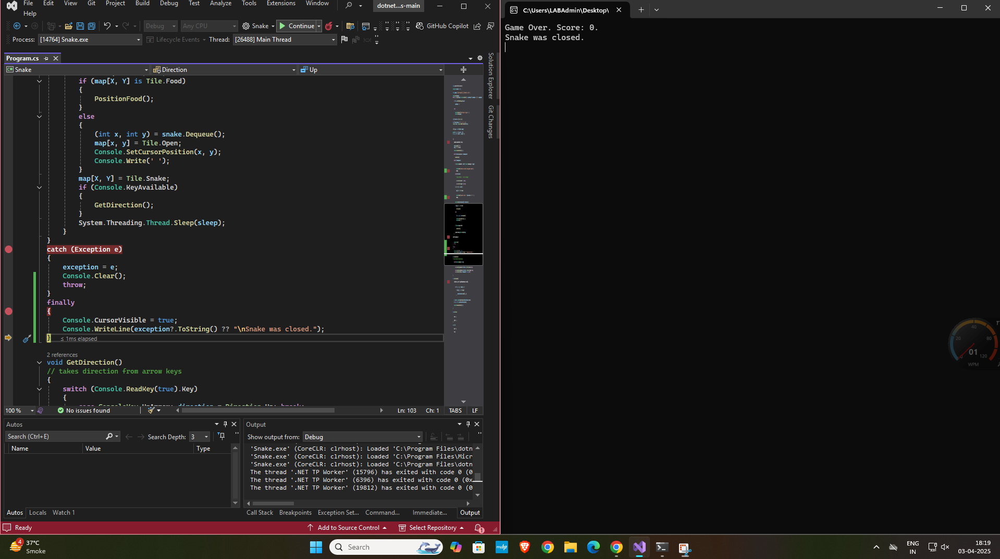
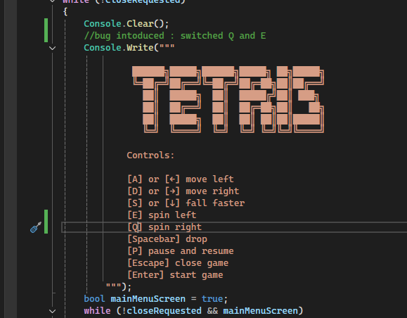
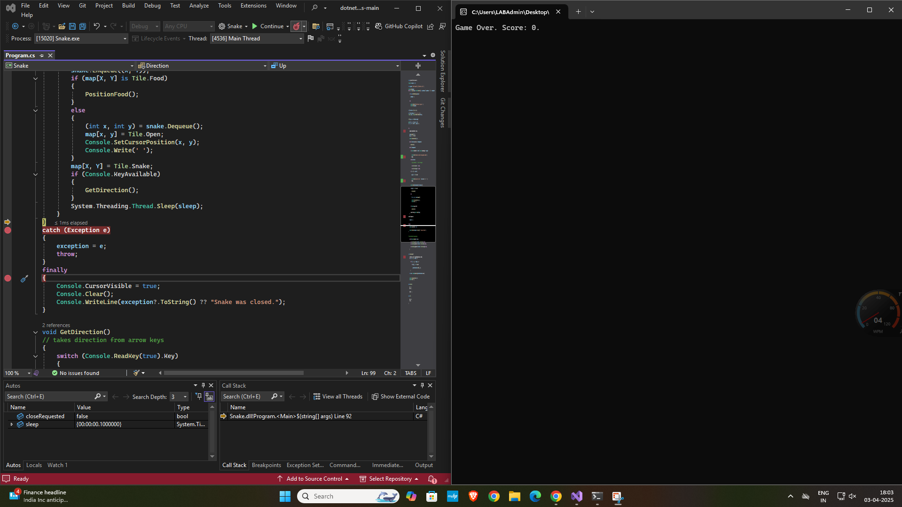
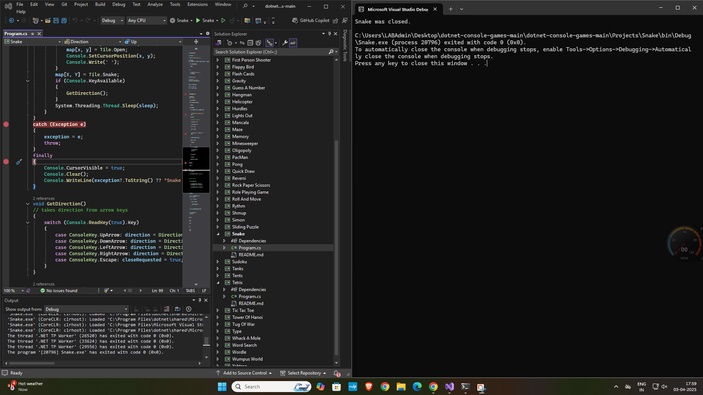
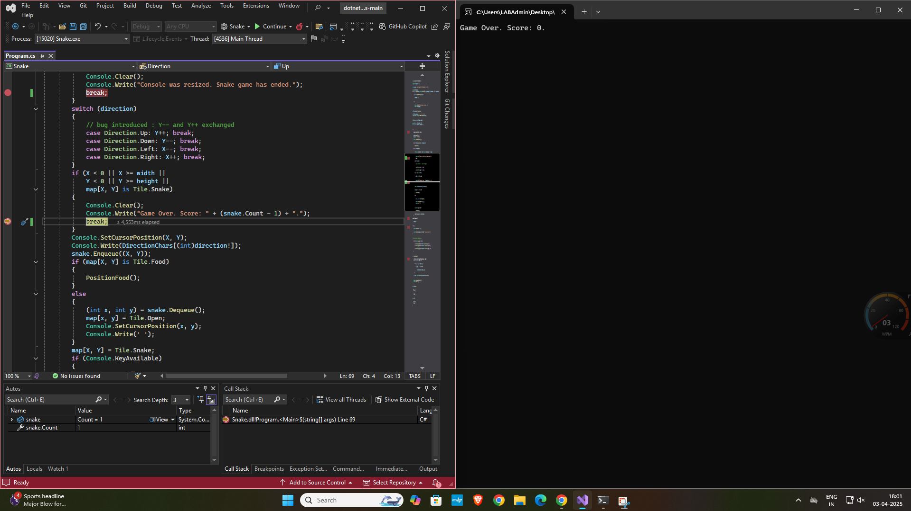
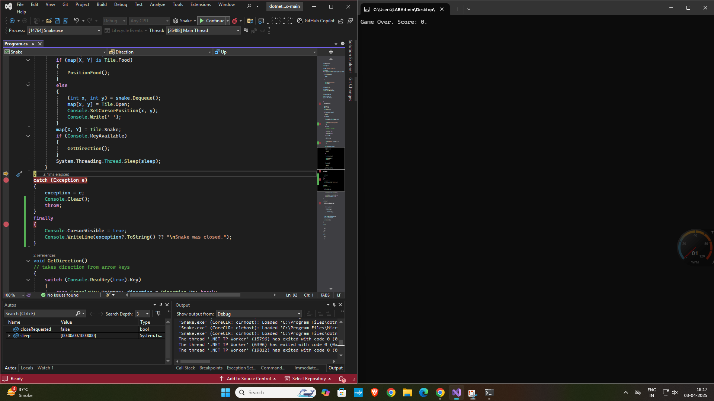
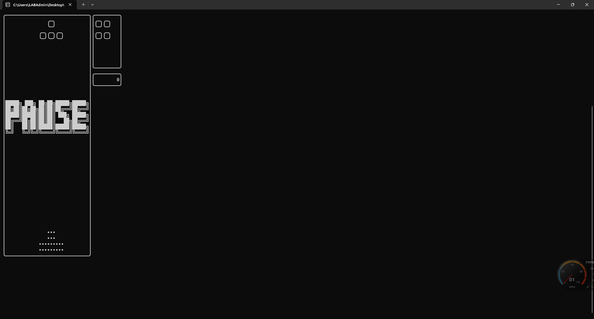

# Lab 12 Report

## Introduction

This lab was about learning event-driven programming in C#. The goal was to see how events can control what an application does, especially in response to things like time passing or user input. I built an alarm clock application, first for the console and then as a Windows Forms (WinForms) application with a graphical interface.

## Methodology and Execution

#### 1. Task 1: Console Alarm Application

##### Design and Implementation

I created a console app where the user could set a time, and the app would print a message when that time was reached. I used the publisher-subscriber pattern.

*   **Publisher:** Had a `SetTime` method that took the target time string. It looped, checking the current time against the target time each second using `Thread.Sleep(1000)`. It also had an event (`RaiseEvent`) that it triggered when the time was reached.
*   **Subscriber:** Had a static `Ring` method. This method was set up to run when the Publisher's `RaiseEvent` was triggered. It printed the alarm message to the console.
*   **Main Program:** Asked the user for hours, minutes, and seconds (with basic 2-digit validation). It created the Publisher, subscribed the `Subscriber.Ring` method to the `RaiseEvent`, and then called `Publisher.SetTime` to begin checking the time.



##### Code: Console Application

**Using Directives and Namespace**
```cs
using System;
using System.Linq;
using System.Threading;
using System.Globalization;

namespace ConsoleAlarmApp
{
```

**Subscriber Class**
```cs
    class Subscriber
    {
        public static void Ring(string targetTimeString)
        {
            string currentTimeString = DateTime.Now.TimeOfDay.ToString(@"hh\:mm\:ss");
            Console.WriteLine($"\nAlarm was set for {targetTimeString}");
            Console.WriteLine($"It's {currentTimeString} now!!");
            Thread.Sleep(1000);
        }
    }
```

**Publisher Class**
```cs
    class Publisher
    {
        public delegate void MyDel(string targetTime);
        public event MyDel RaiseEvent;

        public void SetTime(string targetTimeString)
        {
            Console.WriteLine("Monitoring... Press Ctrl+C to exit early.");
            while (true)
            {
                string currentTimeString = DateTime.Now.TimeOfDay.ToString(@"hh\:mm\:ss");
                Console.WriteLine($"Current Time: {currentTimeString}");

                if (TimeSpan.TryParse(currentTimeString, out TimeSpan current) &&
                    TimeSpan.TryParse(targetTimeString, out TimeSpan target))
                {
                    if (current >= target)
                    {
                        RaiseEvent?.Invoke(targetTimeString);
                        break; // Exit loop
                    }
                } else {
                    Console.WriteLine("Error parsing time."); break;
                }
                Thread.Sleep(1000);
            }
        }
    }
```

**Program Class (Main and Helper)**
```cs
    class Program
    {
        static void Main(string[] args)
        {
            Publisher p = new Publisher();
            p.RaiseEvent += Subscriber.Ring; // Subscribe

            Console.WriteLine("Type in time to set alarm (24-hour format).");
            string h = GetValidatedInput("Hours (00-23):");
            string m = GetValidatedInput("Minutes (00-59):");
            string s = GetValidatedInput("Seconds (00-59):");
            string targetTimeString = $"{h}:{m}:{s}";

            if (!TimeSpan.TryParseExact(targetTimeString, @"hh\:mm\:ss", CultureInfo.InvariantCulture, out _))
            {
                Console.WriteLine($"Invalid time: {targetTimeString}. Exiting."); Console.ReadKey(); return;
            }

            Console.WriteLine($"Alarm set for {targetTimeString}");
            p.SetTime(targetTimeString); // Start

            Console.WriteLine("\nAlarm time passed. Press any key to exit.");
            Console.ReadKey();
        }

        static string GetValidatedInput(string prompt)
        {
            string input;
            do {
                Console.WriteLine(prompt);
                input = Console.ReadLine();
                if (input != null && input.Length == 2 && input.All(char.IsDigit)) return input;
                Console.WriteLine("Invalid input. Please enter exactly 2 digits.");
            } while (true);
        }
    }
} // End namespace
```

#### 2. Task 2: Windows Forms Alarm Application

##### Design and Implementation

I converted the console app into a WinForms app.

*   **Form Design:** I used the Visual Studio designer to create `Form1`. It included:
    *   Labels for the title ("Alarm Clock") and status messages.
    *   Three TextBoxes for H, M, S input.
    *   A Button ("set alarm").
    
*   **Timer:** I added a `System.Windows.Forms.Timer` named `timer` and set its `Interval` to 1000ms.
*   **Event Handlers:**
    *   `button1_Click`: This runs when the button is clicked. It validates the input from the text boxes. If valid, it saves the time as `targetTime`, resets a flag `alarmTriggered`, updates the status label, and starts the `timer`.
    *   `Timer_Tick`: This runs every second while the `timer` is active. It changes the form's background color randomly. It checks if the current time is >= `targetTime` and if the `alarmTriggered` flag is false. If both are true, it stops the `timer`, sets `alarmTriggered` to true, and calls the `Ring` method.
    *   `Ring` Method: This resets the background color, gets the current time, and shows a `MessageBox` with the alarm details. It then updates the status label after the user clicks OK.

##### Code: Windows Forms Application

**Form1.Designer.cs (Partial - Control Setup)**
```cs
namespace PubSubForm
{
    partial class Form1
    {
        // ... (Designer variables, Dispose) ...
        #region Windows Form Designer generated code
        private void InitializeComponent()
        {
            // --- Control Initializations (Button, TextBoxes, Labels) ---
            this.button1 = new System.Windows.Forms.Button();
            this.textBox3 = new System.Windows.Forms.TextBox(); // Seconds
            this.label1 = new System.Windows.Forms.Label();
            // ... other controls ...
            this.label5 = new System.Windows.Forms.Label(); // Status
            this.SuspendLayout();
            // --- Set Control Properties (Location, Name, Size, Text, TabIndex) ---
            // Example:
            this.button1.Location = new System.Drawing.Point(29, 200);
            this.button1.Name = "button1";
            // ... other properties ...
            this.button1.Click += new System.EventHandler(this.button1_Click); // Link event
            // --- Form Setup ---
            this.ClientSize = new System.Drawing.Size(334, 310);
            this.Name = "Form1";
            this.Text = "Alarm Clock App";
            // ... Add Controls to Form ...
            this.ResumeLayout(false); this.PerformLayout();
        }
        #endregion
        // --- Control Declarations ---
        private System.Windows.Forms.Button button1;
        // ... other declarations ...
        private System.Windows.Forms.Label label5;
    }
}
```

**Form1.cs (Logic - Fields and Constructor)**
```cs
using System;
using System.Drawing;
using System.Linq;
using System.Windows.Forms;
using System.Globalization;

namespace PubSubForm
{
    public partial class Form1 : Form
    {
        private System.Windows.Forms.Timer timer;
        private string targetTime; // Format: HH:MM:SS
        private Random random = new Random();
        private bool alarmTriggered = false;

        public Form1()
        {
            InitializeComponent();
            InitializeTimer();
        }

        private void InitializeTimer()
        {
            timer = new System.Windows.Forms.Timer { Interval = 1000 };
            timer.Tick += Timer_Tick;
        }
```

**Form1.cs (Timer_Tick Event Handler)**
```cs
        private void Timer_Tick(object sender, EventArgs e)
        {
            if (alarmTriggered || targetTime == null) return;

            string currentTime = DateTime.Now.TimeOfDay.ToString(@"hh\:mm\:ss");
            this.BackColor = Color.FromArgb(random.Next(256), random.Next(256), random.Next(256));

            if (currentTime.CompareTo(targetTime) >= 0)
            {
                timer.Stop();
                alarmTriggered = true;
                Ring(targetTime);
            }
        }
```

**Form1.cs (Ring Method)**
```cs
        public void Ring(string t)
        {
            this.BackColor = SystemColors.Control; // Reset color before dialog
            this.Update(); // Force repaint

            string currTime = DateTime.Now.TimeOfDay.ToString(@"hh\:mm\:ss");
            MessageBox.Show($"Alarm was set for {t}\nIt's {currTime} now!!",
                            "Alarm Triggered", MessageBoxButtons.OK, MessageBoxIcon.Information);

            label5.Text = "Alarm finished. Set a new one?"; // Update after dialog closes
        }
```

**Form1.cs (button1_Click Event Handler)**
```cs
        private void button1_Click(object sender, EventArgs e)
        {
            string h = textBox1.Text, m = textBox2.Text, s = textBox3.Text;

            if (h.Length != 2 || !h.All(char.IsDigit) || m.Length != 2 || !m.All(char.IsDigit) || s.Length != 2 || !s.All(char.IsDigit))
            { label5.Text = "Please enter 2 digits for HH, MM, SS."; return; }

            string combinedTime = $"{h}:{m}:{s}";

            if (!TimeSpan.TryParseExact(combinedTime, @"hh\:mm\:ss", CultureInfo.InvariantCulture, out _))
            { label5.Text = "Invalid time value (Use HH 00-23, MM/SS 00-59)."; return; }

            targetTime = combinedTime;
            label5.Text = "Alarm set for " + targetTime;
            alarmTriggered = false;
            timer.Start();
        }
    } // End Class
} // End namespace
```

## Results and Analysis

#### Console Application Results

The console app worked. It took the time input correctly and displayed the alarm message when the system time reached the set time.




#### Windows Forms Application Results

The WinForms app also worked as expected.
*   The form looked right and the controls were present.
    
*   Setting a valid time started the timer and the random background color changes. The status label updated correctly.
    
*   Invalid time input showed error messages in the status label.
*   When the alarm time was reached, the `MessageBox` popped up showing the details. The UI felt unresponsive while the box was open.
    
*   After clicking "OK", the background reset and the status label updated.
    

## Conclusion

This lab was a good introduction to event-driven programming in C#. Building the console alarm showed how delegates and events connect parts of the program (publisher and subscriber). Converting it to WinForms demonstrated the need for GUI-friendly tools like `System.Windows.Forms.Timer` to keep the interface responsive, unlike `Thread.Sleep`. I practiced using basic WinForms controls and handling events like button clicks and timer ticks. Overall, the lab helped me understand how events are used to make applications interactive.
