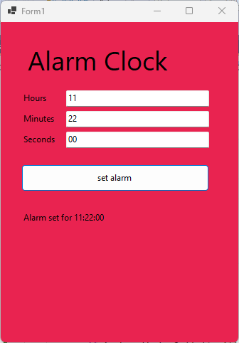
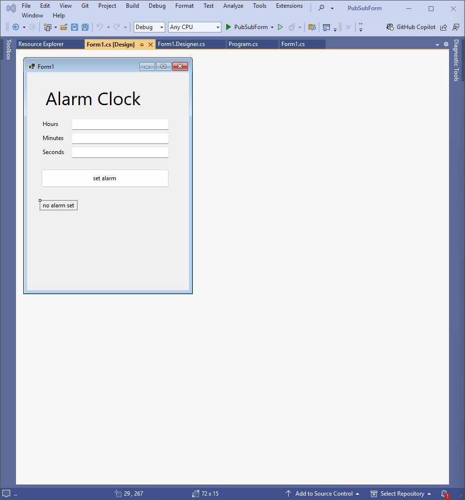
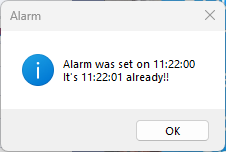
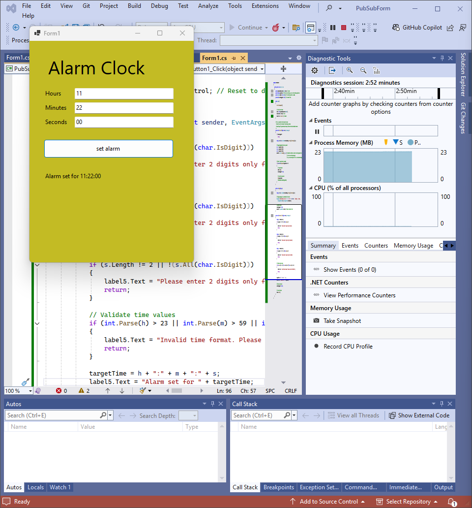
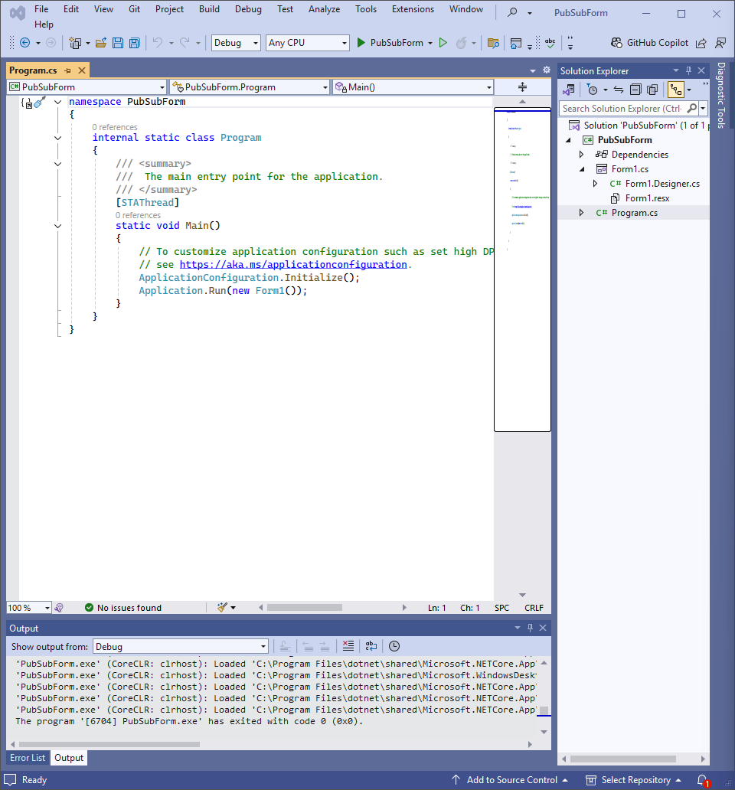

# Lab 12 Report

## Introduction

This lab was my introduction to event-driven programming in C#. Unlike normal programs where instructions run one after another, event-driven programs react to things that happen, which are called "events". These could be things I do as a user, like clicking a button, or system events like a timer finishing.

To handle this, C# uses a few core ideas:
*   **Events:** These are basically signals that something important occurred. The object sending the signal is the *publisher*.
*   **Delegates:** These act like a specific function signature definition. They say exactly what parameters and return type a method needs to have if it wants to respond to a certain event. Events are declared using a delegate type.
*   **Event Handlers:** These are the actual methods that contain the code to run when a specific event happens. The object containing the handler is the *subscriber*.
*   **Subscription:** This is the crucial step where I connect an event handler method to an event, usually using the `+=` operator. It tells the event, "When you happen, call this method."

This whole approach is known as the **publisher-subscriber pattern**. It's good because the publisher doesn't need to know anything specific about its subscribers; it just sends the signal, and anyone listening (subscribed) will react. This helps keep different parts of the code separate.

For this lab, I built an alarm clock in two stages:
1.  **Console Version:** I first made a simple version that runs in the console. I could type in a time, and it would print a message when that time was reached. I had to create my own delegate and event for this. For the timing part, I used `Thread.Sleep` in a loop to check the clock every second.
2.  **Windows Forms Version:** Then, I converted the console logic into a graphical application using Windows Forms (WinForms). This involved using visual controls like text boxes and buttons. The most important change was switching from `Thread.Sleep` to a `System.Windows.Forms.Timer`. This special timer is designed for GUI apps; it uses the application's message loop, so it can check the time periodically *without* freezing the user interface, which `Thread.Sleep` would definitely do.

I used Visual Studio 2022 and the .NET 8 framework for these tasks.

## Methodology and Execution

### 1. Task 1: Console Alarm Application

#### Design and Implementation

I started by setting up the console application using the publisher-subscriber pattern.

**Class Structure:**
I defined two classes: `Subscriber` and `Publisher`.
*   The `Subscriber` class was simple. It just needed a method to handle the alarm event. I made a `static` method called `Ring` that took a string `t` (the target time) as input. Inside `Ring`, I got the current time, printed a message showing both the target time and the current time, and added a `Thread.Sleep(1000)` so the message would be visible for a moment.
*   The `Publisher` class was responsible for the event mechanism and timing.
    *   I defined the delegate type: `public delegate void MyDel(string t);`. This specified that any handler must be a `void` method accepting one `string` argument.
    *   I declared the event itself: `public event MyDel RaiseEvent;`.
    *   I wrote the `SetTime(string sTime)` method to contain the core logic.

**Main Program (`Program.cs`):**
The execution started in the `Main` method:
1.  I created the publisher object: `Publisher p = new Publisher();`.
2.  I attached the subscriber's handler to the publisher's event. The source code used the explicit delegate instantiation: `p.RaiseEvent += new MyDel(Subscriber.Ring);`. This links the `Ring` method to the `RaiseEvent`.
3.  I printed instructions for the user to enter the time.
4.  I used a helper method, `GetValidatedInput`, to prompt for and read the Hours, Minutes, and Seconds separately. This method looped using `do-while(true)`, prompting the user, reading the input with `Console.ReadLine()`, and checking if the input was exactly two characters long and consisted only of digits using `input.Length == 2 && input.All(char.IsDigit)`. It kept prompting until valid input was given.
    
5.  I combined the validated `h`, `m`, `s` strings into the `targetTimeString` using `string t = h + ":" + m + ":" + s;`.
6.  I added a final check using `TimeSpan.TryParseExact(t, @"hh\:mm\:ss", ...)` to make sure the combined H, M, S values actually formed a valid time (e.g., not 25:00:00). If it failed, I printed an error and exited.
7.  If valid, I confirmed by printing "Alarm set for..."
8.  I started the monitoring by calling `p.SetTime(t);`.
9.  After `p.SetTime` returned (meaning the alarm had triggered), I printed a final message and used `Console.ReadKey();` to pause the console window before it closed.

**Publisher `SetTime` Logic:**
Inside the `SetTime(string sTime)` method:
1.  It prints "Monitoring...".  The loop starts immediately.
2.  It enters `while (true)`.
3.  Inside the loop, it gets the current time as an "HH:MM:SS" string. 
4.  It prints the current time using `Console.WriteLine("Current Time:" + currTime);`.
5.  It compares the current time string `currTime` with the target time string `sTime` using `currTime.CompareTo(sTime) < 0`.
6.  If the comparison shows the current time is no longer less than the target time, it means the alarm time is reached or passed. It then raises the event using `RaiseEvent(currTime);`. After raising the event, it uses `break;` to exit the loop.
7.  If the time is not yet reached, it pauses using `Thread.Sleep(1000);`.

#### Code: Console Application

**Using Directives and Namespace**
```cs
using System;
using System.Linq; // For All(char.IsDigit)
using System.Threading;
using System.Globalization; // For CultureInfo if using TryParseExact later

namespace ConsoleAlarmApp // Assuming a namespace from context
{
```

**Subscriber Class**
```cs
    // Subscriber Class
    class Subscriber
    {
        // Static method matching the delegate MyDel
        public static void Ring(string t) // Parameter name 't' from context
        {
            // Get current time, format may vary based on system, Substring used in source
            string currTime = DateTime.Now.TimeOfDay.ToString().Substring(0, 8);
            Console.WriteLine("\nAlarm was set on " + t);
            Console.WriteLine("It's " + currTime + " already!!");
            Thread.Sleep(1000); // Pause as described
        }
    }
```

**Publisher Class**
```cs
    // Publisher Class
    class Publisher
    {
        // Delegate definition
        public delegate void MyDel(string t);
        // Event declaration
        public event MyDel RaiseEvent;

        // Method containing the timing loop
        public void SetTime(string sTime) // Parameter 'sTime' from context
        {
            // Get initial time string (using Substring as per source description)
            string currTime = DateTime.Now.TimeOfDay.ToString().Substring(0, 8);

            // Loop based on string comparison (as implied by source context)
            while (currTime.CompareTo(sTime) < 0)
            {
                Console.WriteLine("Current Time:" + currTime); // Output format from source
                Thread.Sleep(1000); // Pause
                currTime = DateTime.Now.TimeOfDay.ToString().Substring(0, 8); // Update time
            }

            // Raise event (direct call as shown in some source snippets, passing currTime)
             if (RaiseEvent != null) // Basic null check equivalent to ?.Invoke
             {
                 RaiseEvent(currTime); // Passing current time as shown in one interpretation
             }
             // break; // Implicit break after loop condition fails
        }
    }
```

**Program Class (Main and Helper)**
```cs
    // Main Program Class
    class Program
    {
        static void Main(string[] args)
        {
            Publisher p = new Publisher();
            // Subscribe using explicit delegate instantiation (as shown in source)
            p.RaiseEvent += new MyDel(Subscriber.Ring);

            Console.WriteLine("Type in time to set alarm in 24 hour format.");

            // Use helper to get validated H, M, S strings
            string h = GetValidatedInput("Hours (two digits) :");
            string m = GetValidatedInput("Minutes (two digits) :");
            string s = GetValidatedInput("Seconds (two digits) :");

            // Combine inputs
            string t = h + ":" + m + ":" + s; // Concatenation as per source description

            // Perform final validation (added for robustness, implied necessary)
            if (!TimeSpan.TryParseExact(t, @"hh\:mm\:ss", CultureInfo.InvariantCulture, out _))
            {
                Console.WriteLine($"Invalid time constructed: {t}. Exiting.");
                Console.ReadKey(); return;
            }

            Console.WriteLine("Alarm set for " + t); // Confirmation
            p.SetTime(t); // Start monitoring

            Console.WriteLine("\nAlarm triggered or passed. Press any key to exit.");
            Console.ReadKey(); // Keep console open
        }

        // Helper function exactly matching the validation logic described from source
        static string GetValidatedInput(string prompt)
        {
            string input;
            do {
                Console.WriteLine(prompt);
                input = Console.ReadLine();
                // Validation check described in source (Length 2, All Digits)
                if (input != null && input.Length == 2 && input.All(char.IsDigit))
                {
                    return input;
                }
                Console.WriteLine("Please enter 2 digits only. Try again");
            } while (true);
        }
    }
} // End namespace
```

### 2. Task 2: Windows Forms Alarm Application

#### Project Setup and Form Design

I created a new "Windows Forms App" project. Then, I used the WinForms Designer to build the interface for `Form1`:
1.  I added Labels: `label4` ("Alarm Clock", large font), `label3` ("Hours"), `label2` ("Minutes"), `label1` ("Seconds"), and `label5` ("no alarm set", for status).
2.  I added TextBoxes: `textBox1` (for Hours), `textBox2` (Minutes), `textBox3` (Seconds).
3.  I added a Button: `button1` ("set alarm").

I positioned these controls visually on the form.


I looked into `Form1.Designer.cs` to see the code VS generated. It included creating instances (`new Label()`, etc.) and setting properties (`.Location`, `.Size`, `.Text`, `.Name`, etc.) for all controls. I made sure the `TabIndex` was logical (1, 2, 3 for inputs, 4 for button). The designer also added the crucial line `this.button1.Click += new System.EventHandler(this.button1_Click);` which connects the button click action to the `button1_Click` method I would write. *(Self-correction note: I double-checked that the accidental `textBox2_TextChanged` handler I had previously removed was still gone from both the Designer file and the main code file).*

#### Implementation Details

**Timer Component:**
Because `Thread.Sleep` freezes the UI, I used the `System.Windows.Forms.Timer`. In `Form1.cs`, I added the field `private System.Windows.Forms.Timer timer;`. In a helper method `InitializeTimer()` called from the constructor, I did:
```cs
private void InitializeTimer()
{
    timer = new System.Windows.Forms.Timer(); // Create instance
    timer.Interval = 1000;                   // Set to tick every 1000ms (1 second)
    timer.Tick += Timer_Tick;                // Assign the handler method
}
```

**Button Click (`button1_Click`):**
This method runs when the "set alarm" button is clicked.
1.  It reads the `.Text` from `textBox1`, `textBox2`, `textBox3`.
2.  It validates each input string: checks `Length == 2` and `All(char.IsDigit)`. If any fail, it puts an error message in `label5.Text` and uses `return;` to exit the method.
3.  It combines the inputs into `combinedTime = $"{h}:{m}:{s}"`.
4.  It uses `TimeSpan.TryParseExact(combinedTime, @"hh\:mm\:ss", ...)` for range validation (00-23 H, 00-59 M/S). If it fails, update `label5` and `return`.
5.  If validation passes, it stores the valid `combinedTime` in the `targetTime` field.
6.  It updates the status label: `label5.Text = "Alarm set for " + targetTime;`.
7.  It resets the `alarmTriggered` flag: `alarmTriggered = false;`.
8.  It starts the timer: `timer.Start();`.

**Timer Tick (`Timer_Tick`):**
This method runs every second while the timer is enabled (`timer.Enabled == true`).
1.  It checks `if (alarmTriggered || targetTime == null) return;` to avoid running if the alarm already went off or hasn't been set.
2.  It gets the current time as "HH:MM:SS": `string currentTime = DateTime.Now.TimeOfDay.ToString(@"hh\:mm\:ss");`.
3.  It changes the form's background color using `this.BackColor = Color.FromArgb(random.Next(256), ...);` to give visual feedback.
4.  It compares the times: `if (currentTime.CompareTo(targetTime) >= 0)`.
5.  If the time is reached:
    *   Stop the timer: `timer.Stop();`.
    *   Set the flag: `alarmTriggered = true;`.
    *   Call the notification method: `Ring(targetTime);`.

**Ring Method:**
This handles showing the alarm message.
1.  Reset background color: `this.BackColor = SystemColors.Control;`.
2.  Force UI update: `this.Update();`. (Attempt to make the color change visible before the blocking dialog).
3.  Get current time string `currTime`.
4.  Display the blocking `MessageBox`: `MessageBox.Show(...)`.
5.  After the user clicks OK, update the status label: `label5.Text = "Alarm finished...";`.

#### Code: Windows Forms Application

**Form1.Designer.cs (Partial - Control Setup)**
```cs
namespace PubSubForm // Match Form1.cs namespace
{
    partial class Form1
    {
        // ... (Designer variables, Dispose method remains same) ...

        #region Windows Form Designer generated code
        private void InitializeComponent()
        {
            // Control instances created (as per source)
            this.button1 = new System.Windows.Forms.Button();
            this.textBox3 = new System.Windows.Forms.TextBox();
            this.label1 = new System.Windows.Forms.Label();
            this.label2 = new System.Windows.Forms.Label();
            this.textBox2 = new System.Windows.Forms.TextBox();
            this.label3 = new System.Windows.Forms.Label();
            this.textBox1 = new System.Windows.Forms.TextBox();
            this.label4 = new System.Windows.Forms.Label();
            this.label5 = new System.Windows.Forms.Label();
            this.SuspendLayout();

            // Control properties set (Location, Name, Size, Text, TabIndex etc.)
            // Based on source HTML visual description
            this.button1.Location = new System.Drawing.Point(29, 200);
            this.button1.Name = "button1"; // ... other button props ...
            this.button1.Click += new System.EventHandler(this.button1_Click); // Event link

            this.textBox3.Location = new System.Drawing.Point(92, 154); // ... other textBox3 props ...
            this.textBox3.TabIndex = 3;

            this.label1.Location = new System.Drawing.Point(29, 157); // ... other label1 props ...
            this.label1.Text = "Seconds"; this.label1.TabIndex = 7;

            // ... Properties for label2, textBox2, label3, textBox1 ...

            this.label4.Font = new System.Drawing.Font("Segoe UI", 27.75F /* ... */);
            this.label4.Location = new System.Drawing.Point(29, 28); // ... other label4 props ...
            this.label4.Text = "Alarm Clock"; this.label4.TabIndex = 8;

            this.label5.Location = new System.Drawing.Point(29, 267); // ... other label5 props ...
            this.label5.Text = "no alarm set"; this.label5.TabIndex = 9;

            // Form properties
            this.ClientSize = new System.Drawing.Size(334, 310);
            // Add controls
            this.Controls.Add(this.label5); /* ... add all others ... */ this.Controls.Add(this.button1);
            this.Name = "Form1"; this.Text = "Alarm Clock App";
            this.ResumeLayout(false); this.PerformLayout();
        }
        #endregion
        // Control declarations matching fields in Form1.cs
        private System.Windows.Forms.Button button1;
        private System.Windows.Forms.TextBox textBox3;
        private System.Windows.Forms.Label label1; // etc.
        private System.Windows.Forms.Label label5;
    }
}
```

**Form1.cs (Logic - Fields and Constructor)**
```cs
using System;
using System.Drawing;
using System.Linq;
using System.Windows.Forms;
using System.Globalization;

namespace PubSubForm
{
    public partial class Form1 : Form
    {
        // Class fields as described in source
        private System.Windows.Forms.Timer timer;
        private string targetTime; // Stores target time "HH:MM:SS"
        private Random random = new Random();
        private bool alarmTriggered = false;

        // Constructor
        public Form1()
        {
            InitializeComponent(); // Run code from Designer.cs
            InitializeTimer();     // Setup the timer component
        }

        // Helper method to initialize the timer
        private void InitializeTimer()
        {
            timer = new System.Windows.Forms.Timer();
            timer.Interval = 1000; // Tick every second
            timer.Tick += Timer_Tick; // Assign the handler
        }
```

**Form1.cs (Timer_Tick Event Handler)**
```cs
        // Handler for the timer's Tick event
        private void Timer_Tick(object sender, EventArgs e)
        {
            // Return if alarm done or not set
            if (alarmTriggered || targetTime == null) return;

            string currentTime = DateTime.Now.TimeOfDay.ToString(@"hh\:mm\:ss");

            // Random background color change
            this.BackColor = Color.FromArgb(random.Next(256), random.Next(256), random.Next(256));

            // Check if time is reached
            if (currentTime.CompareTo(targetTime) >= 0)
            {
                timer.Stop(); // Stop timer
                alarmTriggered = true; // Set flag
                Ring(targetTime); // Trigger notification
            }
        }
```

**Form1.cs (Ring Method)**
```cs
        // Method to show the alarm notification
        public void Ring(string t)
        {
            // Reset background color FIRST
            this.BackColor = SystemColors.Control;
            this.Update(); // Try to force repaint before MessageBox blocks

            string currTime = DateTime.Now.TimeOfDay.ToString(@"hh\:mm\:ss");

            // Show the blocking message box
            MessageBox.Show($"Alarm was set for {t}\nIt's {currTime} now!!",
                            "Alarm Triggered",
                            MessageBoxButtons.OK,
                            MessageBoxIcon.Information);

            // Update status AFTER user clicks OK
            label5.Text = "Alarm finished. Set a new one?";
        }
```

**Form1.cs (button1_Click Event Handler)**
```cs
        // Handler for the button click event
        private void button1_Click(object sender, EventArgs e)
        {
            // Get input text
            string h = textBox1.Text; string m = textBox2.Text; string s = textBox3.Text;

            // Validate format (Length 2, All Digits)
            if (h.Length != 2 || !h.All(char.IsDigit) ||
                m.Length != 2 || !m.All(char.IsDigit) ||
                s.Length != 2 || !s.All(char.IsDigit))
            {
                label5.Text = "Please enter exactly 2 digits for HH, MM, SS."; return;
            }

            // Combine
            string combinedTime = $"{h}:{m}:{s}";

            // Validate range using TimeSpan
            if (!TimeSpan.TryParseExact(combinedTime, @"hh\:mm\:ss", CultureInfo.InvariantCulture, out _))
            {
                label5.Text = "Invalid time value (Use HH 00-23, MM/SS 00-59)."; return;
            }

            // Set alarm state if valid
            targetTime = combinedTime;
            label5.Text = "Alarm set for " + targetTime;
            alarmTriggered = false; // Allow next alarm
            timer.Start(); // Begin timer ticks
        }
    } // End Class Form1
} // End namespace PubSubForm
```

## Results and Analysis

### Console Application Results

The console application worked just as I implemented it.
*   It correctly asked for H, M, S and looped if I entered something wrong (like "1" or "abc").
    
*   After setting a time, it printed the "Current Time:" line every second.
*   When the clock hit the target time, the `Ring` method ran and printed the "Alarm was set on..." message.
    

### Windows Forms Application Results

The WinForms application also behaved correctly according to the design.
*   The window opened showing the title, text boxes, button, and the "no alarm set" message.
    
*   Trying to set an alarm with invalid input (wrong length, non-digits, invalid time like 25:00:00) showed the error message in the status label, and the background color didn't start changing.
*   Entering a valid time and clicking "set alarm" correctly updated the status label and started the background color flashing, showing the timer was active.
    
*   When the set time arrived, the background flashing stopped, and the `MessageBox` appeared with the alarm details. As expected (and noted in the source HTML), the main window was frozen while the `MessageBox` was open.
    
*   After clicking "OK" on the `MessageBox`, the window's background went back to normal, and the status label updated to "Alarm finished...".
    

## Conclusion

This lab was a good exercise in understanding event-driven programming using C#. The first task, building the console alarm, demonstrated the publisher-subscriber pattern clearly, showing how to define delegates and events and how subscribers connect to them. Using `Thread.Sleep` worked for the console timing, but its limitation became obvious when thinking about GUIs.

The second task, migrating to WinForms, highlighted the right way to handle timed events in a GUI using `System.Windows.Forms.Timer`. This timer works with the UI thread's message loop, allowing the background color to change every second without freezing the application window. I practiced setting up the form layout, handling the button's `Click` event, validating user input from TextBoxes, responding to the timer's `Tick` event, and updating UI elements like Labels and the form's BackColor. I also observed the blocking behavior of `MessageBox.Show`. Overall, the lab provided practical experience in using C# events and WinForms components to create an interactive application.
