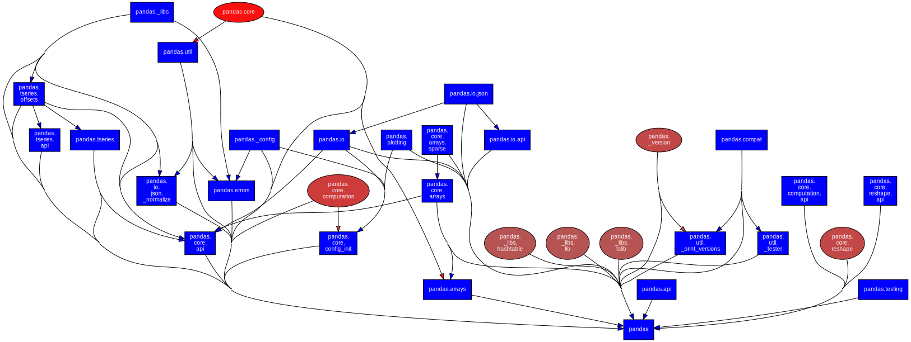
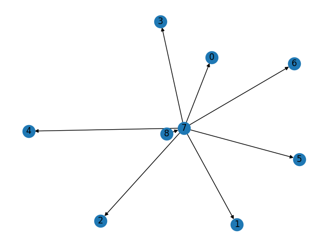
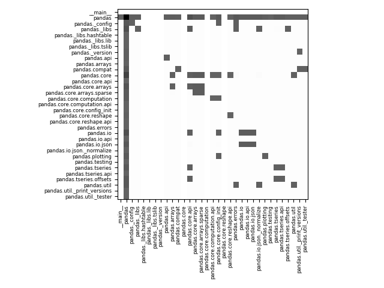

## Introduction

This lab is focused on cohesivity and coupling of modules in Python and Java projects using tools such as `pydeps` and `LCOM` .

#### Cohesion

Cohesiveness is a measure of how much do the functions in a module have in common, and how much we benefit from modularisation being done in that way.
The hierarchy of cohesiveness, from low to high is :
1. coincidental cohesion : random collections of functions
2. logical cohesion : functions perform similar, or interdependent operations
3. temporal cohesion : functions are all run in a particular time frame.
4. procedural cohesion : the functions achieve individual steps or phases of some algorithm, which may still have some complicated control flow.
5. communication cohesion : the functions query and update the same data (global variables and such)
6. sequential cohesion : the functions are steps in a squence of steps ; not just any algorithm, with complicated control flow .
7. functional cohesion : the elements of a module cooperate to achieve a single common goal, which is the goal of the module. (example : managing an employee's pay-roll) . We can describe such a goal in one sentence.

#### Coupling

Coupling between 2 modules is a measure of how interdependent they are. The levels of coupling are (from low to high) :
1. data coupling : there is transfer of primitive data types between the modules.
2. stamp coupling : there is transfer of complex data types, such as objects and structs
3. control coupling : the data shared aren't just values, but also flags
4. common coupling : some global data (variables) are shared between the modules
5. content coupling : code is shared between functions of two modules. This violates the principle of information hiding that a module is supposed to have.

We will be dealing mostly with content coupling.

#### Layered design

Just as hardware modules, software modules with functional cohesion have a concept of 
- fan-in : The number of modules that depend on this module
- fan-out : The number of modules this module depends on
- depth : number of modules used in a sequence to accomplish the main task.
- width : The span of the layered design

A good design typically has low fan-out (generally related to low functional cohesion) and high fan-in (code reuse) . This also makes it easy to debug in terms of dependencies.

Thesse dependencies can be visualised using Module Graphs.

#### PyDeps

`pydeps` is a python module for dependency visualisation. It finds dependencies using the `import` op-codes in the compiled bytecode (`.pyc` files) for the Python VM.

It uses a scoring function called "Bacon" which lets us filter out the modules that are a given number of hops away from our module of interest.

It also allows for clustering, folding of external modules, cycle detection, etc.

`pydeps` also outputs JSON as an intermediate format.


#### Lack of cohesion in methods (LCOM)

LCOM is a tool for analysing dependencies for Java projects.
It provides five versions of LCOM scoring metrics : LCOM1,LCOM2,LCOM3,LCOM4,LCOM5
and one new metric called YALCOM.

#### Yet another Lack of cohesion in methods (YALCOM)

For a type/class $t$ which has non-zero number of methods and isn't just an interface, we compute its LCOM value by this algorithm :

-  initialise $G = (V,E)$ as an empty graph.
-  $V := V \cup t.\text{methods}() $
-  $V := V \cup t.\text{attributes}() $
-  $t_0 := t.\text{supertype}()$
-  $V := V \cup t_0.\text{attributes}()$
-  for $m$ in $t.\text{methods}()$:
   -  for $a$ in $m.\text{attributesAccessed}()$:
      -  $E := E \cup \{(m, a)\}$
   -  for $m'$ in $m.\text{methodInvocatons}()$:
      -  $E := E \cup \{(m, m')\}$
-  $d = G.\text{disconnectedMethods}()$
-  if $d =  1$ : return $0$
-  else : return $d / |t.\text{methods}()|$

Note that here, we will disregard the static attributes just as the compiler does.

In short, create the dependency graph $G$ between methods and (non-static) attributes.
Then find the number of connected components that have at least one method in it, namely $d = G.\text{disconnectedMethods}()$.
This is similar to the LCOM4 metric, which is essentially the number of connected components (including non-method components).
If $d$ is less than some fixed threshold $l$ then returm 0, else return that number, divided by number of methods.

For a type with no cohesion between the methods, we would have the value 1.
And for a very cohesive set of methods, where every method interacts with ever other method, by either calling it, or modifying some shared data, we have $d =1$ and thus, LCOM value of 0.

## Methodology

### Project selection

The real world Python project that I'll be using for this lab is [Pandas (44.9K stars)](https://github.com/pandas-dev/pandas/tree/main), since it has a lot of modules, and is a rather big project.
Similar to pandas, [JTableSaw (3.6K stars)](https://github.com/jtablesaw/tablesaw/tree/master) is a Java library for data manipulation and visualisation.
This, just like Pandas, has a lot of modules. So, I'll be using it for this lab.

### Depenency Graph analysis

#### Instability

To rank the modules based on how likely they are to be have errors introduced due to changes in other modules, I'll be taking the same approach that is taken by the package [module-coupling-metrics](https://pypi.org/project/module-coupling-metrics/) . That is, we rank based on 

$$
\text{instability} = \frac{\text{fan out}}{\text{fain in} + \text{fain out}}
$$

So, the modules with low instability are less prone to have errors after a commit.

#### degree of coupling

Since there is no way to find the actual degree of coupling between two modules using just the JSON output, I'll use the output of the original PageRank algorithm to find how much a particular module is coupled with the rest of the modules. The modules which are ranked higher are more coupled. These are usually modules that have low fan-out and high fan-in. This will be done using the `networkx` Python package.

#### Cycles

To find all the cycles in a graph, we cannot use a simple algorithm like DFS or BFS. Instead, we have to either resort to finding a cycle-basis, for undirected graphs, or the simple cycles (with no repeated nodes) in a directed graph. This is a hard problem, and is achieved using the `networkx` Python package.

#### Depth

Since there are cycles in the dependency graphs, we cannot simply use the shortest path tree algorithm or such, to determine, at which level a module is.

For the sake of clarity, the outermost module, namely `__main__` will be assigned a depth 0, since it is closest to the end user. And modules that are more hidden, such as libraries for doing internal tasks, will have higher depth.
If there exists a cycle that has modules $x,y$ in it, then the depths of $x$ and $y$ must be the same. Essentialy, for a group of nodes such that every node can be reached by every other node through some path, the depths must be the same. What we just described is known as a strongly connected component. 
The Python library `networkx` has the function `condensation` which will allow us to do find and connect the strongly connected components. Then, we can simply do a shortest path tree approach on the condensed graph to find the depths.

### Dependency Impact Assessment

We can model this using population growth dynamics, namely using a transition matrix. At each step, we'll have account of the exected value of functional changes in a module due to the changes in initial module. Then, every iteration, all the changes, in every module propogate themselves. This keeps on going.
Here are a few rules that are followed during progogation of changes.

1. Every change in a module triggers changes in dependent modules only one time, and with a probability $p$ for every edge, where $p$ is some hyper-parameter.
2. Every new change is propogated as well.
3. The sum of changes in all the steps for a module is finally how much it will change.
   
First, let's cosider the transition matrix $P = p A$ where $A$ is the adjacency matrix for the dependency graph, with dependents on rows and dependencies on columns.
Consider the intial change $c_0 = [\delta_{s,i}]_i$ if module $s$ was changed. 
This induces changes $c_1 = Pc_0$ , which further induce changes $c_2 = Pc_1 = P^2c_1$ and so on.
In general, $c_n = P^nc_0$ . The sum of all these changes is

$$
S = \lim_{N\to \infty} \sum_{n=0}^{N-1} P^n c_0
$$

Notice that $c_n \ge \vec 0$ , i.e. it has positive elements

Also, when $1/p$ is more than the highest fan-in value $f$, then we necessarily have $|c_n|_1 \le fp|c_{n-1}|_1 \implies \lim_{n\to\infty} c_{n} = 0$. We also have

$$
I - P^N = (I-P) (\sum_{n=0}^{N-1} P^n) \implies\\
c_0 - P^Nc_0 = (I-P) (\sum_{n=0}^{N-1} P^n) c_0 \implies\\
c_0 = (I-P) (\sum_{n=0}^{N-1} P^n) c_0 + c_n \;\forall N
$$

So, taking the limit as $N\to \infty$, we get

$$
c_0 = (I-P)S
$$

Of course, sometimes the matrix $I-P$ may not be invertible. In such a case, most we can do if apply a pseudo-inverse, that is, project the vector $c_0$ onto the span of $(I-P)$ and then solve for $S$. This is still ok, as long as it gives us a sensible output.

Thus, our formula for changes becomes

$$
S = (X^TX)^{-1}X^T c_0 \text{ where } X = I - p A
$$

So, the $i$th column of $ (X^TX)^{-1}X^T $ tells us the effect of changing module $i$ by one unit.
Let's take a row so that it becomes the $i$th row instead, and subtract the identity matrix from it, so that it doesn't account for the initial change.
Thus, we define the effect matrix as $((X^TX)^{-1}X^T)^T - I$

We can use this to figure out the modules that are most susceptible to change when a particular module changes. For sake of simplicity, let's only limit ourselves to 5 such modules.

We can also rank the modules based on the total amount of change they are likely to bring.

### `analysis1.py`

All the above things are accomplised using this program :

```python
import json
import pandas as pd
import networkx as nx
import numpy as np
import matplotlib.pyplot as plt
with open('/home/hp/STT/STTLab9/pandas_deps.json', 'r') as file:data = json.load(file)

print("Making Graph")
A = {x:data[x].get("imports",[]) for x in data} # Adjacency matrix
G = nx.DiGraph(A)
l = len(A)
print(l,"modules found")

print("Making DataFrame")
L = []
cols = ['name', 'fan-in', 'fan-out', 'bacon']
for x in data:
    y = data[x]
    z = [y['name'],len(y.get('imported_by', [])),len(y.get('imports', [])),y.get('bacon', 0)]
    L.append(z)
df = pd.DataFrame(L, columns=cols).dropna()

print("importance of a module")
ranks = nx.pagerank(G)
df["rank"] = [ranks[x] for x in df["name"].values]

print("instability")
df["instability"] = df["fan-out"]/(df["fan-out"] + df["fan-in"])
df.sort_values(by='instability', ascending=False, inplace=True)

print("saving")
df.to_csv('pandas_deps.csv', index=False)

print("Computing Cycles")
C = nx.simple_cycles(G)
C = [c for c in C if len(c) > 1] # list of all simple cycles
C = sorted(C,key=lambda c:len(c))
f = open("pandas_deps_cycles.txt",'w')
f.write("\n".join([" --> ".join(c) for c in C]))
f.close()

print("Unused or less used modules")
df.loc[(df["fan-in"]<=1).values].to_csv("pandas_deps_unused.csv", index=False)

print("calculating transition matrix")
modules = [x for x in A]
module_num = {x:i for i,x in enumerate(modules)}
p = 0.5/(1+df["fan-in"].max())
print("p is",p)
P = [[0]*l for i in range(l)]
print("memory assigned")
for x in A:
    for y in A[x]:
        P[module_num[x]][module_num[y]] = p
P = np.array(P)
print("P calculated")
X = np.identity(l) - P
print("X calculated. Shape:",X.shape)
d = np.linalg.det(X)
print("det(X) =",d)
if d !=0 : 
    Xinv = np.linalg.inv(X)
    effect = Xinv.T
else:
    XTX = X.T @ X
    print("XTX calculated. Shape:",XTX.shape)
    XTXinv = np.linalg.inv(XTX)
    print("XTXinv calculated. Shape:",XTXinv.shape)
    XTXinvXT = XTXinv @ X.T
    effect = XTXinvXT.T
effect = effect - np.identity(l)
print("effect calculated. Shape:",effect.shape)
L = [["modules"] + modules]
for i in range(l):
    L.append(
        [modules[i]] + 
        [str(x) for x in effect[i]]
        )

L = [",".join(row) for row in L]
L = "\n".join(L)
f = open('pandas_deps_effect.csv','w')
f.write(L)
f.close()

plt.imshow(effect,cmap="Grays")
plt.xticks(range(l),modules,rotation=90,size=6)
plt.yticks(range(l),modules,size=6)
plt.tight_layout()
plt.savefig("pandas_deps_effect.png",format="png")
plt.close()

print("getting ordering")
ordering = {}
for i in range(l):
    effects = effect[i]
    ind = sorted(list(range(l)),key= lambda j : effects[j],reverse=True)
    victims = [modules[j] for j in ind]
    ordering[modules[i]] = victims
total = [sum(row) for row in effect]
ord_tot = sorted(list(range(l)),key=lambda i:total[i],reverse=True)
ord_tot = [modules[i] for i in ord_tot]
ordering = {x:ordering[x] for x in ord_tot}

print("writing JSON string")
L = []
for x in ordering:L.append(repr(x) + " : " + repr(ordering[x]))
L = ",\n".join(L)
L = "{\n" + L + "\n}"
L = L.replace("'","\"")
f = open("pandas_deps_effect.json",'w')
f.write(L)
f.close()

print("condensation")
plt.figure()
H = nx.condensation(G)
nx.draw(H,with_labels=True)
plt.savefig("pandas_deps_cond.png",format="png")
plt.close()
f = open("pandas_deps_cond.json",'w')
groups = H.nodes.data()
L={x[0]:list(x[1]["members"]) for x in groups}
f.write(json.dumps(L,indent=4))
f.close()
```

### Java Cohesion using LCOM

The project chosen is `tablesaw`. The command to run the archive `LCOM.jar` on this is 
```sh
java -jar LCOM.jar -i tablesaw -o . 
```
This outputs the CSV file `TypeMetrics.csv` in the working directy, but also deletes any other files (not folders) that it finds. So, I had to run this before anything else. 

The columns of the CSV file are 

- Project Name (`tablesaw`, for all entries)
- Package Name (file containing the type)
- Type Name (the name of the class)
- LCOM1 score
- LCOM2 score
- LCOM3 score
- LCOM4 score
- LCOM5 score
- YALCOM score

### Classes with high LCOM values and Visualisation

A high LCOM value means that there is lack of cohesion between the methods in a class. This usually means that we should refactor the code to lower the LCOM/YALCOM value.

To find the classes with high LCOM values, we can use the script `analysis2.py`. This also finds the actual JAVA file that has the class, rather than the package name, which may or may not directly relate to source code location. This is possible pnly because of the directory structure that the developers are using.

I am also filtering out test cases, so that we can restrict our attention to only the class definitions.

Since an YALCOM value of -1 means that it wasn't possible to evaluate the score on the given type, I'm filtering out these cases as well.

This leaves us with about 250 types with a valid YALCOM score, in the file `TypeMetrics.csv`. Dealing with each of these is not possible. So, instead, I'll only present the source code of the classes with highest YALCOM values.

The script generates HTML tables to visualise it better.

### `analysis2.py`

```python
import pandas as pd
import numpy as np
import matplotlib.pyplot as plt
import os,ast

def findfile(typename):
    pack = typename + ".java"
    os.system("find tablesaw -name " + pack + "> temp")
    f = open("temp",'r')
    s =f.read().strip()
    if "test" in s : s = ""
    f.close()
    return s.strip()

def getsource(file):
    os.system("cat " + file + "> temp")
    f =open("temp",'r')
    s = f.read()
    f.close()
    s = s.split("\n")
    s = [x for x in s if x.strip() and x.strip()[:6] != "import"]
    s = "\n".join(s)
    s = repr(s)
    return s

# Clean and find file names
df = pd.read_csv("TypeMetrics.csv")
df.drop("Project Name",axis=1,inplace=True)
TypeNames = df["Type Name"].values
Files = [repr(findfile(x)) for x in TypeNames]
df["file"] = Files
df.sort_values("YALCOM",inplace=True,ascending=False)
df = df.where(df["file"]!="''")
df = df.where(df["YALCOM"]>-0.5)
df.dropna(inplace=True)
df.to_csv("TypeMetricsClean.csv",index=False)
top5 = df.head().copy()

# write Top5.csv
files = top5["file"].values
codes = [getsource(file) for file in files]
top5["JAVA code"] = codes
req = ["Type Name","Package Name","JAVA code","LCOM1","LCOM2","LCOM3","LCOM4","LCOM5","YALCOM"]
top5 = top5.loc[:,req]
top5.to_csv("Top5.csv",index=False)

# Make html tables
head = "\n".join(["<tr>","\n".join(["<td>" + x + "</td>" for x in req[2:]]),"</tr>"])
L = ["<table>",head]
for row in top5.values:
    toadd = [
        f"<td>\nclass:{row[0]}<br>\npackage:{row[1]}<pre><small>\n" + 
        ast.literal_eval(row[2]).replace("<","&lt;").replace(">","&gt;") + 
        "\n</small></pre></td>"
    ] + [f"<td>{x}</td>" for x in row[3:]]
    toadd = ["<tr>"] + toadd + ["</tr>"]
    toadd = "\n".join(toadd)
    L.append(toadd)
L.append("</table>")
L = "\n".join(L)
f = open("Top5.html",'w')
f.write(L)
f.close()
```

## Results

### Pandas Dependency Graph



Notice that by default we have the value of `--max-bacon` set to 2. This causes `pydeps` to simplifiy the graph. Since we are already at a desirable complexity, I did not change it.

The same is also present as JSON in `pandas_deps.json` : 

```json
{
    "__main__": {
        "bacon": 0,
        "imports": [
            "pandas"
        ],
        "name": "__main__",
        "path": null
    },
    "pandas": {
        "bacon": 1,
        "imported_by": [
            "__main__",
            "pandas",
            "pandas._config",
            "pandas._libs",
.
.
.
    },
    "pandas.util._tester": {
        "bacon": 2,
        "imported_by": [
            "pandas"
        ],
        "imports": [
            "pandas",
            "pandas.compat"
        ],
        "name": "pandas.util._tester",
        "path": "/home/hp/.local/lib/python3.10/site-packages/pandas/util/_tester.py"
    }
}
```

We then use this and the script to generate the CSV file `pandas_deps.csv` :

```c
name,fan-in,fan-out,bacon,rank,instability
__main__,0,1,0,0.008507799381363788,1.0
pandas.core.api,1,7,2,0.014532894371391245,0.875
pandas.core.config_init,1,6,2,0.014532894371391245,0.8571428571428571
pandas.errors,1,4,2,0.014532894371391245,0.8
.
.
```

The modules are already sorted using instability. So, from this, we can gather that `__main__` is the most unstable module, i.e. one that is most likely to have persistent errors.

#### Highly coupled modules

We can sort these according to the `rank` value generated by PageRank algorithm to get the modules that have highest coupling

The output is :

```c
          name  fan-in  fan-out  bacon      rank  instability
        pandas      26       32      1  0.226826     0.551724
  pandas._libs       6        2      2  0.061934     0.250000
   pandas.core       9        0      2  0.052220     0.000000
     pandas.io       6        3      2  0.049354     0.333333
pandas.io.json       4        3      2  0.045530     0.428571
```

This makes sense as well, since `pandas` is the most important module for the project.

#### Cyclic dependencies

There are in total, 65 simple cycles reported by the script. These are :

```
pandas._libs --> pandas
pandas.io --> pandas
pandas.io --> pandas.io.json
pandas._config --> pandas
pandas.testing --> pandas
pandas.core.config_init --> pandas
pandas.tseries.offsets --> pandas
pandas.core.arrays --> pandas
pandas.core.arrays --> pandas.core.arrays.sparse
pandas.util._print_versions --> pandas
pandas.compat --> pandas
pandas.errors --> pandas
pandas.io.json --> pandas
pandas.tseries.api --> pandas
pandas.util._tester --> pandas
pandas.io.api --> pandas
pandas.tseries --> pandas
pandas.core.reshape.api --> pandas
pandas.arrays --> pandas
pandas.api --> pandas
pandas --> pandas.core.api
pandas --> pandas.core.arrays.sparse
pandas --> pandas.core.computation.api
pandas --> pandas.io.json._normalize
pandas --> pandas.plotting
pandas --> pandas.util
pandas._libs --> pandas --> pandas.core.api
pandas._libs --> pandas --> pandas.errors
pandas._libs --> pandas --> pandas.io.json._normalize
pandas._libs --> pandas --> pandas.tseries.offsets
pandas.io --> pandas --> pandas.core.api
pandas.io --> pandas --> pandas.core.config_init
pandas.io --> pandas --> pandas.io.api
pandas.io --> pandas --> pandas.io.json
pandas.io --> pandas.io.json --> pandas
pandas._config --> pandas --> pandas.core.config_init
pandas._config --> pandas --> pandas.errors
pandas.core.config_init --> pandas.plotting --> pandas
pandas.tseries.offsets --> pandas --> pandas.core.api
pandas.tseries.offsets --> pandas --> pandas.tseries
pandas.tseries.offsets --> pandas --> pandas.tseries.api
pandas.core.arrays --> pandas --> pandas.arrays
pandas.core.arrays --> pandas --> pandas.core.api
pandas.core.arrays --> pandas --> pandas.core.arrays.sparse
pandas.core.arrays --> pandas.core.arrays.sparse --> pandas
pandas.util._print_versions --> pandas.compat --> pandas
pandas.compat --> pandas --> pandas.util._tester
pandas.errors --> pandas.util --> pandas
pandas.io.json --> pandas --> pandas.io.api
pandas.tseries.api --> pandas.tseries --> pandas
pandas.tseries --> pandas --> pandas.core.api
pandas --> pandas.io.json._normalize --> pandas.util
pandas._libs --> pandas --> pandas.core.api --> pandas.tseries.offsets
pandas._libs --> pandas --> pandas.tseries --> pandas.tseries.offsets
pandas._libs --> pandas --> pandas.tseries.api --> pandas.tseries.offsets
pandas.io --> pandas --> pandas.io.api --> pandas.io.json
pandas.io --> pandas.io.json --> pandas --> pandas.core.api
pandas.io --> pandas.io.json --> pandas --> pandas.core.config_init
pandas.io --> pandas.io.json --> pandas --> pandas.io.api
pandas.tseries.offsets --> pandas --> pandas.core.api --> pandas.tseries
pandas.tseries.offsets --> pandas --> pandas.tseries.api --> pandas.tseries
pandas.core.arrays --> pandas.core.arrays.sparse --> pandas --> pandas.arrays
pandas.core.arrays --> pandas.core.arrays.sparse --> pandas --> pandas.core.api
pandas._libs --> pandas --> pandas.core.api --> pandas.tseries --> pandas.tseries.offsets
pandas._libs --> pandas --> pandas.tseries.api --> pandas.tseries --> pandas.tseries.offsets
```

Having so many cyclic dependencies between the modules is not a good thing. In fact, one of the strongly connected components of the dependency graph, namely the one with `pandas` module, has 25 modules, out of the otal of the 33 modules. This causes one change in a module to have effects on almost all the modules. We'll look at all of that soon.

#### Unused modules

Although there aren't any actual disconnected components (not considering `__main__` which is the entry point for the user), there are modules with very low fan-in. Namely these ;

```
name,fan-in,fan-out,bacon,rank,instability
pandas.core.api,1,7,2,0.014532894371391245,0.875
pandas.core.config_init,1,6,2,0.014532894371391245,0.8571428571428571
pandas.errors,1,4,2,0.014532894371391245,0.8
pandas.util._print_versions,1,3,2,0.014532894371391245,0.75
pandas.tseries.api,1,3,2,0.014532894371391245,0.75
pandas.io.json._normalize,1,3,2,0.014532894371391245,0.75
pandas.io.api,1,3,2,0.014532894371391245,0.75
pandas.core.reshape.api,1,3,2,0.014532894371391245,0.75
pandas.core.computation.api,1,3,2,0.014532894371391245,0.75
pandas.arrays,1,3,2,0.014532894371391245,0.75
pandas.util._tester,1,2,2,0.014532894371391245,0.6666666666666666
pandas.testing,1,1,2,0.014532894371391245,0.5
pandas._libs.hashtable,1,0,2,0.014532894371391245,0.0
pandas._libs.lib,1,0,2,0.014532894371391245,0.0
pandas._libs.tslib,1,0,2,0.014532894371391245,0.0
```

Having so many modules with a fan-in of 1 seems like bad design, since there is no code reuse, and these modules could have been written directly inside the modules that import them, and it would have made no difference. 

#### Depths of dependencies

The depth of a layered design is given by how many layers there are. But the layers don't interact in circular fashions usually, i.e. it's expected that feedback should not be present. 

For this repository, it is rather hard to come up with such a layered design, on so, I depended on the condensation of the original graph :



Here, the nodes correspond to these strongly connected components :

```json
0: ["pandas._libs.hashtable"],
1: ["pandas._libs.lib"],
2: ["pandas._libs.tslib"],
3: ["pandas._version"],
4: ["pandas.core"],
5: ["pandas.core.computation"],
6: ["pandas.core.reshape"],
7: [
    "pandas._libs",
    "pandas.io",
    "pandas._config",
    "pandas.testing",
    "pandas.core.config_init",
    "pandas.tseries.offsets",
    "pandas.core.arrays",
    "pandas.compat",
    "pandas.tseries.api",
    "pandas.core.reshape.api",
    "pandas.arrays",
    "pandas",
    "pandas.core.computation.api",
    "pandas.io.json._normalize",
    "pandas.util",
    "pandas.core.arrays.sparse",
    "pandas.util._print_versions",
    "pandas.io.json",
    "pandas.tseries",
    "pandas.core.api",
    "pandas.errors",
    "pandas.util._tester",
    "pandas.io.api",
    "pandas.api",
    "pandas.plotting"
   ],
8: ["__main__"]
```

Thus, in reality, there are only 3 layers.

### Dependency impact assessment

The value of effect matrix, as discussed in the methodology outputted by the program is stored in `pandas_deps_effect.csv` .

To help with visualisation, we have the heat map `pandas_deps_effect.png` :



I then used that to rank the modules based on the total expected change caused by an unit change in the module, and further, I sorted the receipients of the induced change by the expected amount of change they recieve. This gives us the JSON file `pandas_deps_effect.json` which has effect decreasing from top to bottom and left to right.

The top-left $5\times 5$ entries are :

```json
"pandas" :              ["pandas", "pandas.core.api","pandas.core.config_init",
                         "pandas.errors", "pandas.core.arrays.sparse"],
"pandas.core" :         ["pandas", "pandas.core.arrays", "pandas.core.arrays.sparse",
                         "pandas.core.api", "pandas.arrays"],
"pandas.io" :           ["pandas", "pandas.io.api", "pandas.io.json", "pandas.io","pandas.core.api"],
"pandas._libs" :        ["pandas", "pandas.core.api", "pandas.errors",
                         "pandas.io.json._normalize", "pandas._libs"],
"pandas.core.arrays" :  ["pandas", "pandas.core.arrays.sparse", "pandas.core.arrays",
                         "pandas.core.api", "pandas.arrays"]
```

Thus, these are the modules that have the most potntial to break the system if disturbed wrongly.

### LCOM.jar output

The raw ouptut is stored in `TypeMetrics.csv` :

```
Project Name,Package Name,Type Name,LCOM1,LCOM2,LCOM3,LCOM4,LCOM5,YALCOM
tablesaw,tech.tablesaw.io.arrow,ArrowWriterTest,3.0,3.0,3.0,3.0,0.5,0.0
tablesaw,tech.tablesaw.io.arrow,ArrowReader,3.0,0.0,2.0,1.0,0.3333333333333333,0.0
tablesaw,tech.tablesaw.io.arrow,ArrowWriter,6.0,0.0,4.0,1.0,0.0,0.0
tablesaw,tech.tablesaw.io.html,HtmlWriterTest,5.0,4.0,5.0,5.0,0.8333333333333334,0.0
.
.
.
```

This output, when cleaned, and associated with file paths, gives us the CSV file `TypeMetricsClean.csv`

```
Package Name,Type Name,LCOM1,LCOM2,LCOM3,LCOM4,LCOM5,YALCOM,file
tech.tablesaw.columns.numbers,FloatColumnType,15.0,0.0,6.0,6.0,1.0666666666666669,1.0,'tablesaw/core/src/main/java/tech/tablesaw/columns/numbers/FloatColumnType.java'
tech.tablesaw.aggregate,DateAggregateFunction,6.0,0.0,4.0,4.0,0.0,1.0,'tablesaw/core/src/main/java/tech/tablesaw/aggregate/DateAggregateFunction.java'
tech.tablesaw.aggregate,BooleanIntAggregateFunction,6.0,0.0,4.0,4.0,0.0,1.0,'tablesaw/core/src/main/java/tech/tablesaw/aggregate/BooleanIntAggregateFunction.java'
.
.
.
```

### High LCOM classes

Since it's hard to analyse each module, we should restrict ourselves to modules that have high YALCOM/LCOM values.

<table>
<tr>
<td>JAVA code</td>
<td>LCOM1</td>
<td>LCOM2</td>
<td>LCOM3</td>
<td>LCOM4</td>
<td>LCOM5</td>
<td>YALCOM</td>
</tr>
<tr>
<td>
class:FloatColumnType<br>
package:tech.tablesaw.columns.numbers<pre><small>
package tech.tablesaw.columns.numbers;
/** The {@link ColumnType} for {@link FloatColumn} */
public class FloatColumnType extends AbstractColumnType {
  public static final int BYTE_SIZE = 4;
  /** Returns the default parser for {@link FloatColumn} */
  public static final FloatParser DEFAULT_PARSER = new FloatParser(ColumnType.FLOAT);
  private static FloatColumnType INSTANCE;
  private FloatColumnType(int byteSize, String name, String printerFriendlyName) {
    super(byteSize, name, printerFriendlyName);
  }
  /** Returns the singleton instance of FloatColumnType */
  public static FloatColumnType instance() {
    if (INSTANCE == null) {
      INSTANCE = new FloatColumnType(BYTE_SIZE, "FLOAT", "float");
    }
    return INSTANCE;
  }
  /** {@inheritDoc} */
  @Override
  public FloatColumn create(String name) {
    return FloatColumn.create(name);
  }
  /** {@inheritDoc} */
  @Override
  public FloatParser customParser(ReadOptions options) {
    return new FloatParser(this, options);
  }
  /** Returns true if the given value is the missing value indicator for this column type */
  public static boolean valueIsMissing(float value) {
    return Float.isNaN(value);
  }
  /** Returns the missing value indicator for this column type */
  public static float missingValueIndicator() {
    return Float.NaN;
  }
}
</small></pre></td>
<td>15.0</td>
<td>0.0</td>
<td>6.0</td>
<td>6.0</td>
<td>1.0666666666666669</td>
<td>1.0</td>
</tr>
<tr>
<td>
class:DateAggregateFunction<br>
package:tech.tablesaw.aggregate<pre><small>
package tech.tablesaw.aggregate;
/** A partial implementation of aggregate functions to summarize over a date column */
public abstract class DateAggregateFunction extends AggregateFunction&lt;DateColumn, LocalDate&gt; {
  /**
   * Constructs a DateAggregateFunction with the given name. The name may be used to name a column
   * in the output when this function is used by {@link Summarizer}
   */
  public DateAggregateFunction(String name) {
    super(name);
  }
  /**
   * Returns an instance of LocalDate that is the result of applying this function to the given
   * column
   */
  public abstract LocalDate summarize(DateColumn column);
  /** {@inheritDoc} */
  @Override
  public boolean isCompatibleColumn(ColumnType type) {
    return type.equals(ColumnType.LOCAL_DATE);
  }
  /** {@inheritDoc} */
  @Override
  public ColumnType returnType() {
    return ColumnType.LOCAL_DATE;
  }
}
</small></pre></td>
<td>6.0</td>
<td>0.0</td>
<td>4.0</td>
<td>4.0</td>
<td>0.0</td>
<td>1.0</td>
</tr>
<tr>
<td>
class:BooleanIntAggregateFunction<br>
package:tech.tablesaw.aggregate<pre><small>
package tech.tablesaw.aggregate;
/**
 * A partial implementation of an AggregateFunction that returns an Integer value when applied to a
 * Boolean Column
 */
public abstract class BooleanIntAggregateFunction
    extends AggregateFunction&lt;BooleanColumn, Integer&gt; {
  /**
   * Constructs a BooleanCountFunction with the given name. The name may be used to name a column in
   * the output when this function is used by {@link Summarizer}
   */
  public BooleanIntAggregateFunction(String functionName) {
    super(functionName);
  }
  /** Returns an Integer as a result of applying this function to the given column */
  @Override
  public abstract Integer summarize(BooleanColumn column);
  /** {@inheritDoc} */
  @Override
  public boolean isCompatibleColumn(ColumnType type) {
    return type.equals(ColumnType.BOOLEAN);
  }
  /** {@inheritDoc} */
  @Override
  public ColumnType returnType() {
    return ColumnType.DOUBLE;
  }
}
</small></pre></td>
<td>6.0</td>
<td>0.0</td>
<td>4.0</td>
<td>4.0</td>
<td>0.0</td>
<td>1.0</td>
</tr>
<tr>
<td>
class:NumericAggregateFunction<br>
package:tech.tablesaw.aggregate<pre><small>
package tech.tablesaw.aggregate;
/** A partial implementation of aggregate functions to summarize over a numeric column */
public abstract class NumericAggregateFunction extends AggregateFunction&lt;NumericColumn&lt;?&gt;, Double&gt; {
  /**
   * Constructs a NumericAggregateFunction with the given name. The name may be used to name a
   * column in the output when this function is used by {@link Summarizer}
   */
  public NumericAggregateFunction(String name) {
    super(name);
  }
  /** {@inheritDoc} */
  @Override
  public boolean isCompatibleColumn(ColumnType type) {
    return type.equals(ColumnType.DOUBLE)
        || type.equals(ColumnType.FLOAT)
        || type.equals(ColumnType.INTEGER)
        || type.equals(ColumnType.SHORT)
        || type.equals(ColumnType.LONG);
  }
  /** {@inheritDoc} */
  @Override
  public ColumnType returnType() {
    return ColumnType.DOUBLE;
  }
}
</small></pre></td>
<td>3.0</td>
<td>0.0</td>
<td>3.0</td>
<td>3.0</td>
<td>0.0</td>
<td>1.0</td>
</tr>
<tr>
<td>
class:TimeAggregateFunction<br>
package:tech.tablesaw.aggregate<pre><small>
package tech.tablesaw.aggregate;
/** A partial implementation of aggregate functions to summarize over a time column */
public abstract class TimeAggregateFunction extends AggregateFunction&lt;TimeColumn, LocalTime&gt; {
  /**
   * Constructs a TimeAggregateFunction with the given name. The name is used as a column name in
   * the output
   */
  public TimeAggregateFunction(String name) {
    super(name);
  }
  /** Returns a LocalTime object that is the result of applying this function to the given Column */
  public abstract LocalTime summarize(TimeColumn column);
  /** {@inheritDoc} */
  @Override
  public boolean isCompatibleColumn(ColumnType type) {
    return type.equals(ColumnType.LOCAL_TIME);
  }
  /** {@inheritDoc} */
  @Override
  public ColumnType returnType() {
    return ColumnType.LOCAL_TIME;
  }
}
</small></pre></td>
<td>6.0</td>
<td>0.0</td>
<td>4.0</td>
<td>4.0</td>
<td>0.0</td>
<td>1.0</td>
</tr>
</table>


## Conclusion

This lab provided an in-depth analysis of software design by examining the cohesion and coupling of modules within real-world projects. By applying tools such as pydeps for dependency visualization and LCOM metrics for Java, the study uncovered several key insights:

- Cohesion and Coupling: The hierarchical approach to cohesion helps in understanding how well functions within a module work together. Meanwhile, the coupling analysis—ranging from data to content coupling—highlights the potential risks of shared code and global data, emphasizing the need for careful modular design.

- Dependency Graph Analysis: The exploration of the Pandas dependency graph revealed significant cyclic dependencies. These cycles, particularly the extensive interdependencies in the main pandas module, indicate potential fragility, where changes in one module may propagate broadly across the system.

- Metrics for Impact Assessment: Using PageRank and instability metrics allowed for the ranking of modules based on their susceptibility to error propagation. The heat maps and effect matrices further demonstrated which modules are most critical, suggesting areas where design improvements could mitigate risks.

- Java Cohesion Analysis: The LCOM and YALCOM metrics applied to the Tablesaw project identified classes with high lack of cohesion. These classes are prime candidates for refactoring, which could lead to more maintainable and robust codebases.

Overall, the lab underscores the importance of balancing cohesion and coupling in software architecture. By carefully analyzing module interdependencies, developers can identify weak points in their designs, streamline code maintenance, and ultimately build more reliable systems.